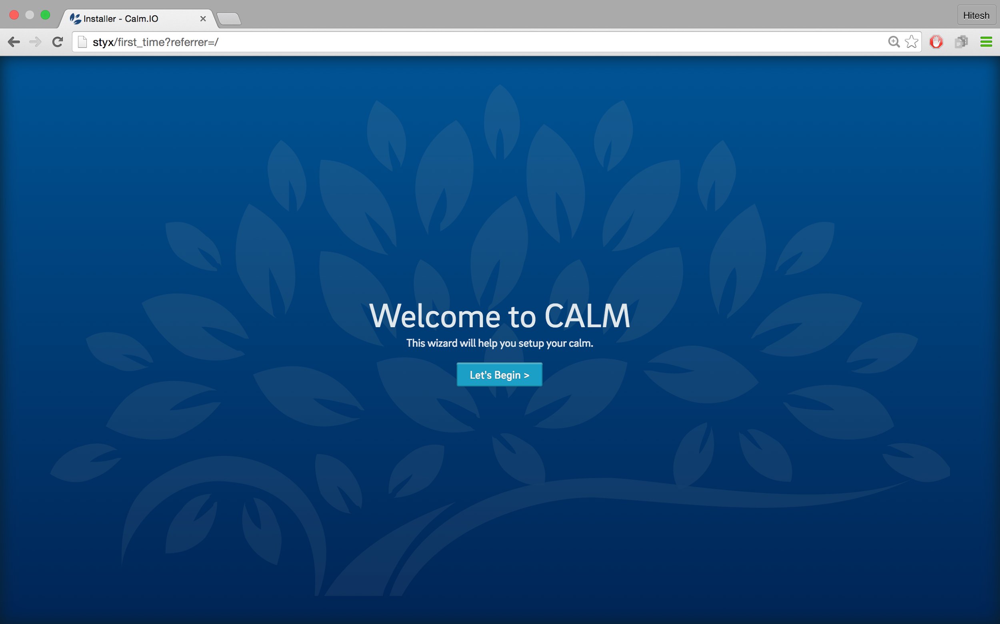
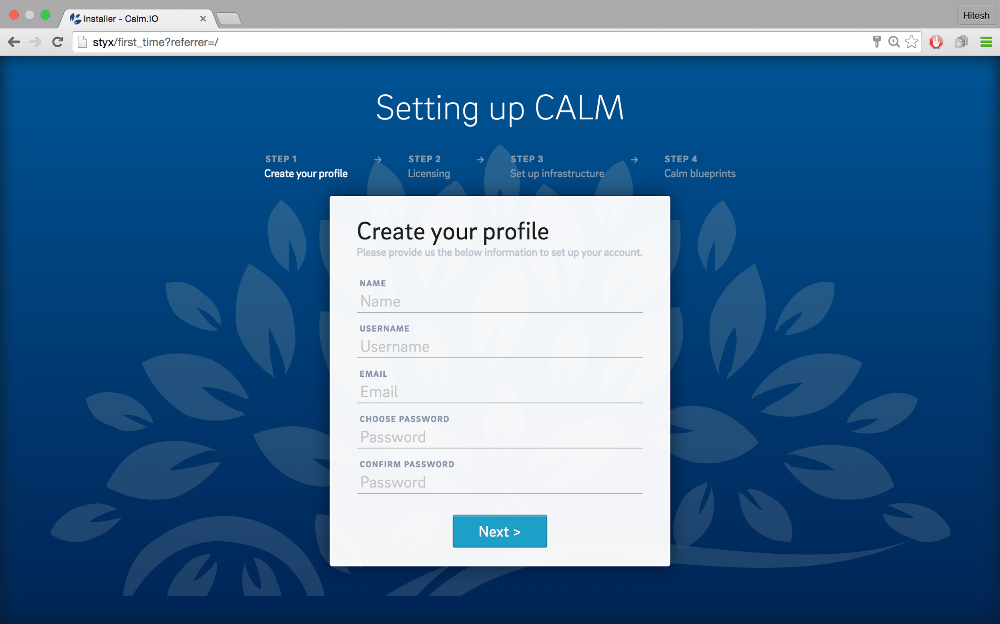
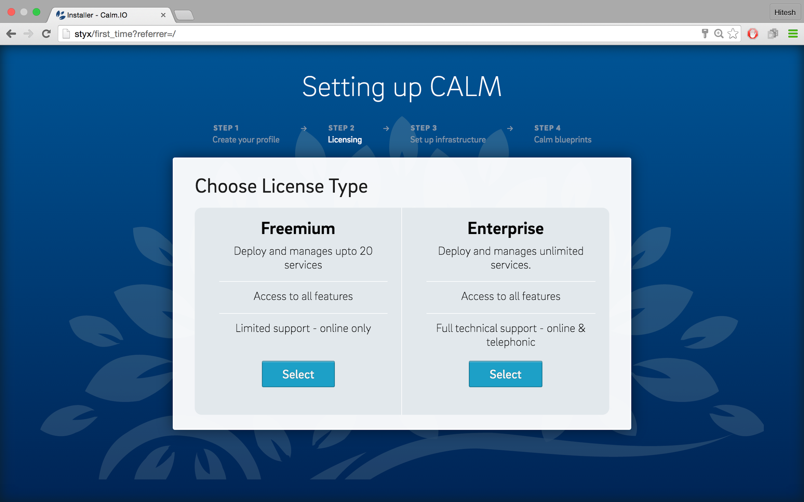
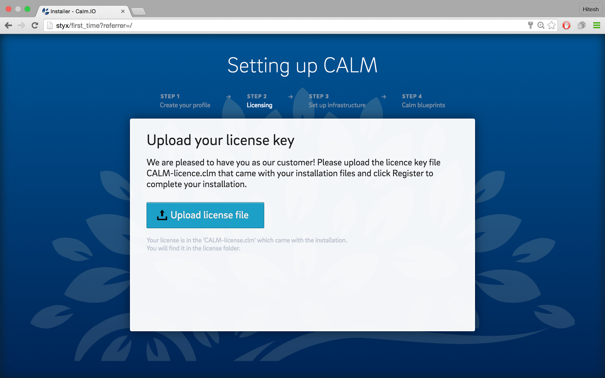
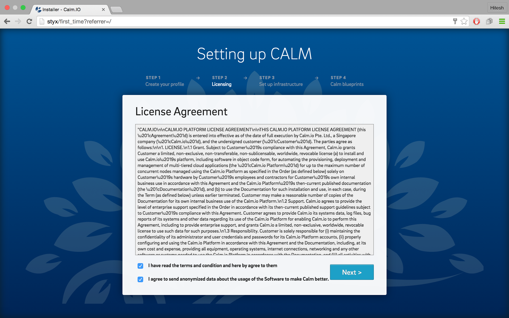
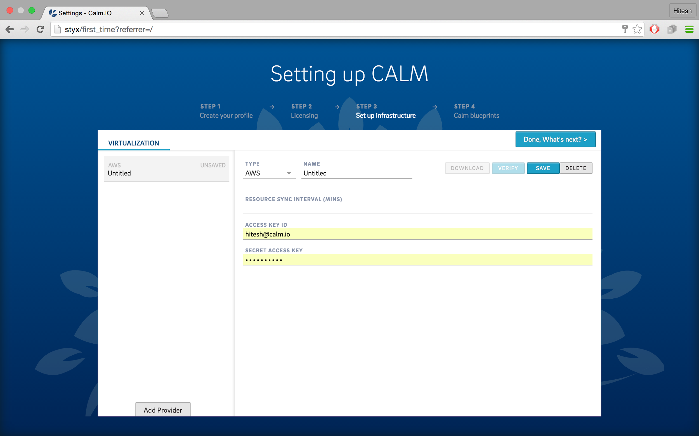
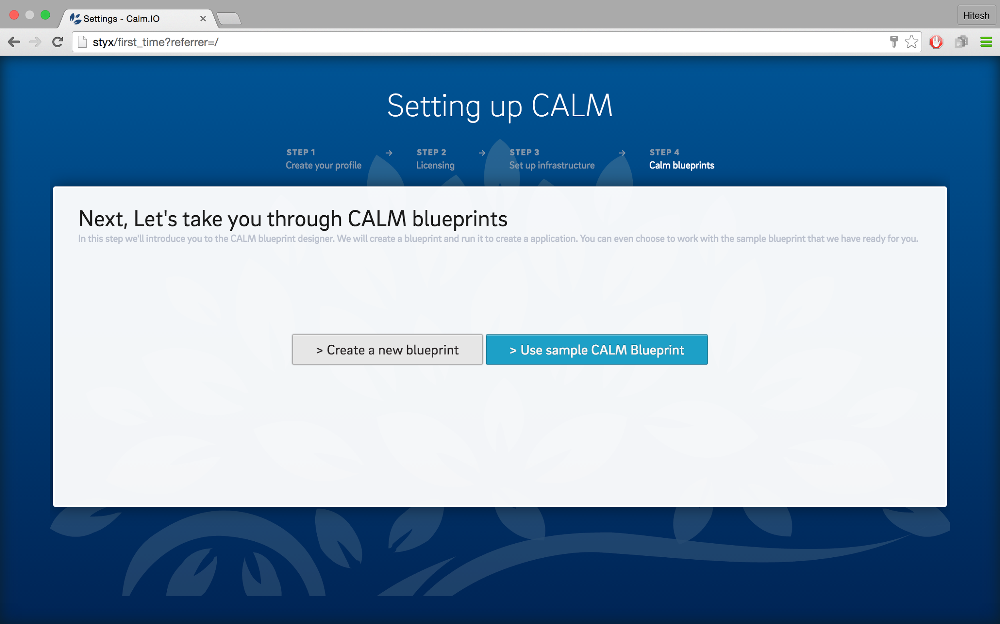

# Setting up Calm

Now that you’ve launched and accessed your Calm AMI, you can go ahead and register yourself for a Calm account and proceed with setting it up. 

To set up Calm, do the following:

1. Select **Let’s Begin**.

2. **Create Your Profile** by filling up the form and select **Next**, once you’re done.  

3. Choose your **License Type**. If you’ve selected a **Freemium** license, proceed with step **5**. If you’ve opted for an **Enterprise** license, upload the **License file** that was provided to you. 
**_Note_***: If you do not have an Enterprise license file, get in touch with our Support team at [support@calm.io](mailto:support@calm.io) to get one.*

4. Read through the **License Agreement,** select the checkboxes if you agree to the terms and select **Next**.

5. Setup your Infrastructure by selecting a **Provider** that you’d like to add.

6. Enter the settings and credentials for the **Provider** you’ve selected. 
**_Note_***: Steps ***_6_*** and ***_7_*** are optional. You can add your ***_Providers_*** later from the ***_Settings_*** section of your Calm instance. *

7. Choose **Create a New Blueprint** or **Use Sample Calm Blueprint** to go to the **Blueprint** editor on Calm. 

