# Example Blueprint

Creating a blueprint consists of several steps, depending on the type of application that you are modelling. In this example, we will use Calm to model a deployment with AWS EC2 instances that uses a scalable NGINX array with an HAProxy load balancer.

#### Steps to be taken for provisioning the services

* Provision an NGINX array service

* Provision an HAProxy service

* Install Chef on the NGINX array

* Deploy NGINX using a Chef cookbook on the NGINX array.

* Setup NGINX Docroot on the array

* Restart NGINX

* Install Chef on the HAProxy service

* Evaluate the HAProxy configuration

* Deploy HAProxy on the instance using Chef cookbooks. 

#### Steps to be taken to setup flows

* Setup a flow to show all running processes on the NGINX array and the HAProxy service. 

* Setup a scale up flow on the NGINX array

* Setup the evaluation of the HAProxy configuration post scale up. 

* Setup a flow to update the Chef node post scale up. 

* Setup a scale down flow on the NGINX array

* Setup the evaluation of the HAProxy configuration post scale down. 

* Setup a flow to update the Chef node post scale down. 

* Setup a flow on the HAProxy service to print the contents of the HAProxy configuration file. 

## Provisioning Your Services

The first step in building your blueprint is to provision the services that your application needs. In this example, we need two services; one is an NGINX array and the other is your HAProxy server. 

Let us add the NGINX array to the canvas. 

* Name your blueprint in the **Blueprint Name** field. 
* In the **Overview** section, add a Description for the blueprint. 
* Select the **Providers** that you'd like to use for this blueprint by their names that you've given in the **Settings** section while configuring Calm. 
* If you'd like to set permissions for this blueprint, pick the teams that you'd like to give access to this blueprint to from the **Permissions** section.

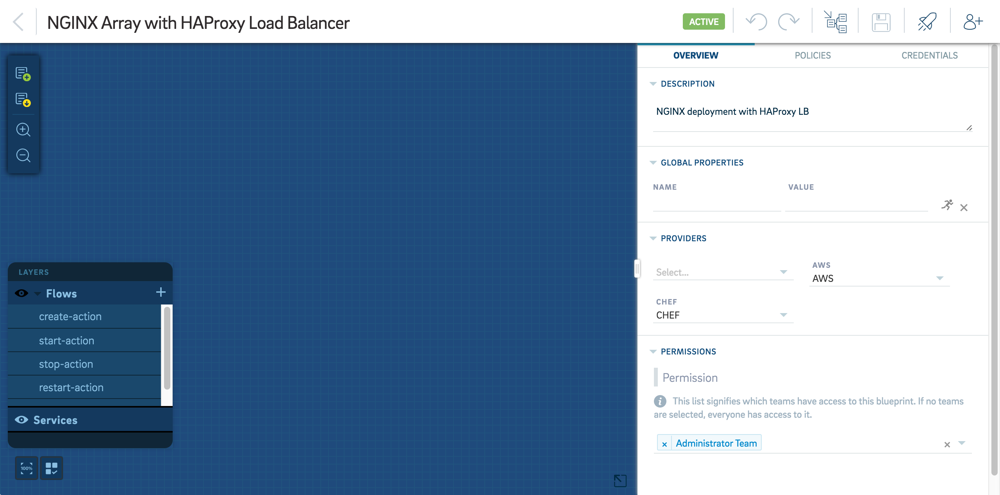

* Select the **Credentials** tab to add a credential for the service. 

!!! tip "Note"
	The new credential that you set should be the default SSH credentials that are used to connect to Ubuntu EC2 images along with your AWS Private Key or the AWS Public Key. 

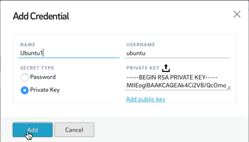

* Select  on the blueprint canvas to add your first service.
* **Name** this service and set the **Provider** **Type** to **Provision AWS EC2**. 
* Under **Array** **Configuration**, select **This is an array service** and set the **Initial Count** to **2**.
* Under **Provider Configuration**, set the **Instance Name**, **Availability Region** and select **Ubuntu 14.04** as the **AMI**. 
* Under **Instance Configuration**, select the **Instance Type**, the **Network** that you’d like to launch into, the **Security** **Groups**, **Shutdown** **Behavior**, **IAM** **Role** and the **Key** **Pair** to connect with your instance.

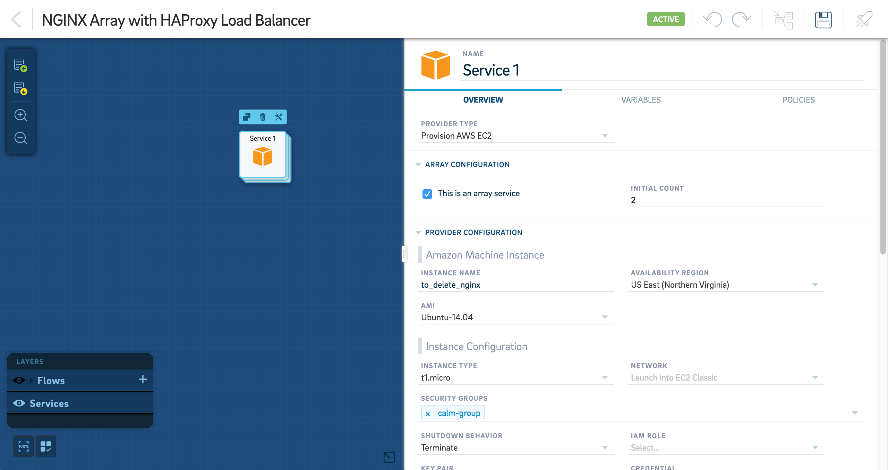

* Optionally, add additional **Storage** and **Tags**. 

8. Ensure that **Service** **Type** is set to SSH under **Attributes**. You can also add the cost of provisioning the EC2 instance in the Cost/HR field if you have configured budgets for your team. The amount that you enter here will be deducted from the budget that you've assigned to the team that is using this blueprint. To know more about budgets, read [Budgets](#budgets).

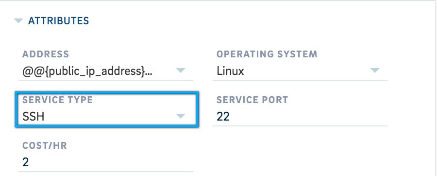

* Select the **Variables** tab to set two **Properties**, the public IP and the public DNS. 

10. Name the first property as **Public IP** and set the **Value** to **Provision AWS EC2 | private_ip_address**.

11. Name the second property as **Public DNS** and set the **Value** to **Provision AWS EC2 | private_dns_name**. This step would ensure that these properties will be available for the haproxy instance to use when required.

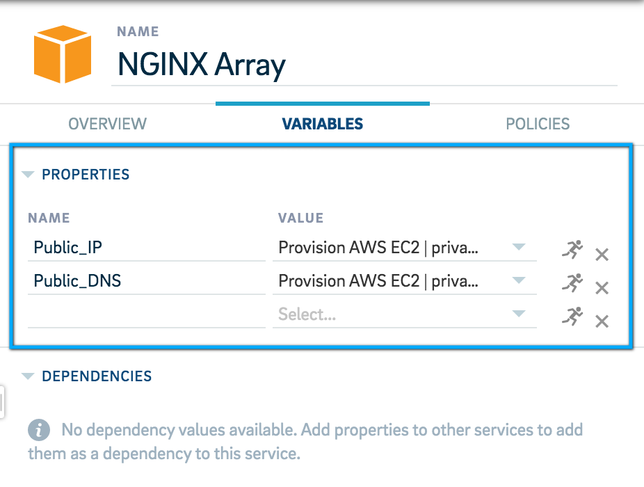

* Optionally, add an **Approval** policy by selecting the Policies tab. 

13. Select **Save**. 

Now that your NGINX array has been added, we can now add the HAProxy server to the canvas in similar fashion. The steps to be followed are similar to those that we followed while adding the NGINX array except that we do not add an **Array** **Configuration**. We also do not need to add a new set of credentials to be used with this service since we are provisioning another Ubuntu EC2 image to act as the HAProxy server and they can be SSH’ed into using the same credentials that we added in the previous step. We will also expose a single variable which is the **Public DNS** of the server and set the value to **Provision AWS EC2 | private_dns_name**. **Save** your blueprint so that the changes that we’ve made take effect. 

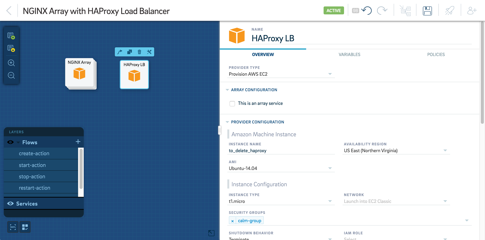

## Creating Dependencies

Since the HAPRoxy server is dependant on the NGINX array for their properties such as the array IP addresses and the DNS, we will define and create dependencies between these two services so that the properties that the HAProxy server is dependant on can be retrieved and used while performing tasks on the application or for setting it up. 

To create a dependency between the HAProxy server and the NGINX array, do the following:

* Select the HAPRoxy Server from the blueprint canvas and then select the **Variables** tab. 

2. Under **Dependencies**, add **nginx_addresses** as the name of the first dependency with the value **<Service Name> | Public IP**. 

3. Add **nginx_dns** as the second dependency with the value **<Service Name> | Public DNS**. 

!!! tip "Note"
	Here **<Service Name>** indicates the name that you’ve given to the NGINX array service while adding it to the blueprint.

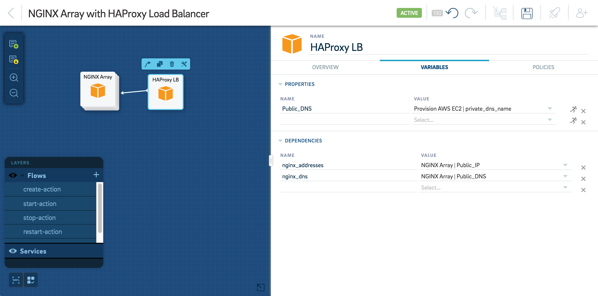

This creates a dependency between the HAProxy server and the NGINX array to retrieve properties from the NGINX array. 

Alternatively, you can also add dependencies by doing the following:

* Select the HAProxy server from the canvas and click on .

* Extend the arrow to connect it with the NGINX array. This gives you a popup screen where you can add and configure the new dependency.

* Give your dependency a **Name** and select a corresponding and appropriate **Value** from the drop-down menu and then select **OK**. 

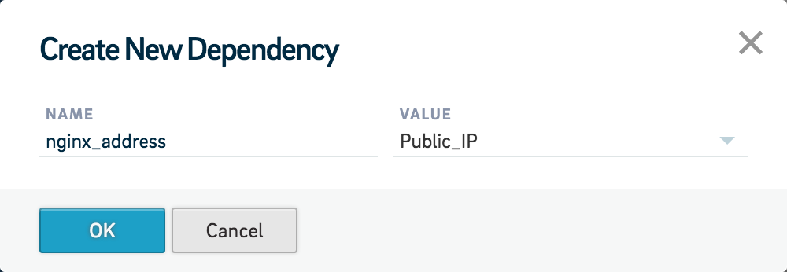 

You can add dependencies only for variables that have been configured in your services while provisioning them.

* Repeat steps **1** to **3** to add your required number of dependencies. 
* Select **Save** to save your blueprint.  

## Adding Tasks To Your Services 

Now that you’re NGINX array and HAProxy services have been added to the blueprint, we need to add tasks that will install the set of software that the services need to function as an NGINX array and an HAProxy server. 

The NGINX array requires Chef to be installed, the use Chef cookbooks to install NGINX on the array, setup a root directory on the array and a restart of the array once the installation and setup is complete. In order to add tasks to carry out these operations, do the following:

### Installing Chef on the Array

* Select the NGINX array service from the blueprint canvas and then click , **Create** and then **Add Task**.

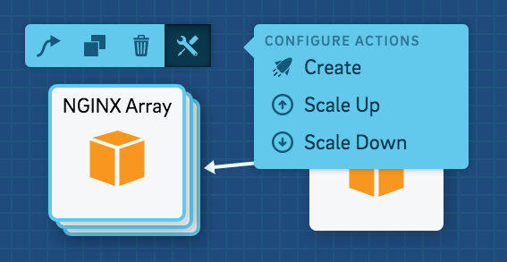

2. Give the task a **Name** and select **Run** **Shell** as the task **Type**. 

3. Select **Ubuntu** as the **Credential** to be used on the service. 

4. Enter a **Script** that installs Chef.

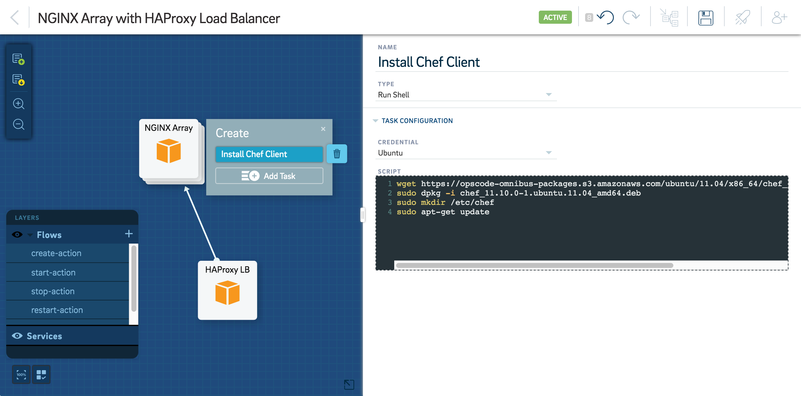

* Select **Save**. 

### Using Chef To Deploy NGINX on the Array 

* Select **Add Task** on the NGINX array. 

2. **Name** the task.  

3. Select **Deploy** **Chef** as the task **Type**.

4. Under **Task Configuration**, enter the **Node Name** as shown below. 

5. Select the NGINX **Cookbook** and its **Version**. 

6. Select a **Role** and the **Environment**. 

7. Set the **Credential** to **Ubuntu**. 

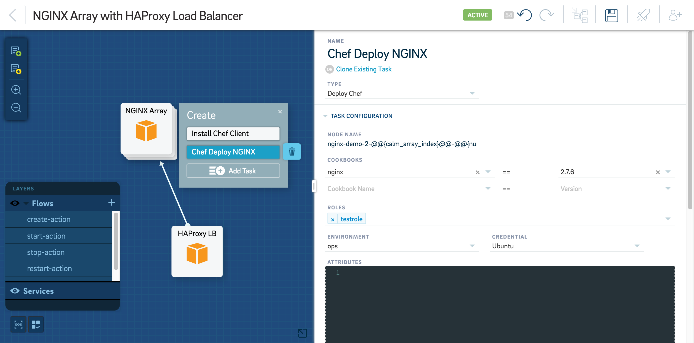

* Select **Save**.

### Setting Up Nginx Docroot

* Select **Add Task** on the NGINX array.  

2. **Name** the task. 

3. Select **Run** **Shell** as the task **Type**. 

4. Select **Ubuntu** as the **Credential** to be used on the service. 

5. Enter a **Script** that sets up a root directory on the array. 

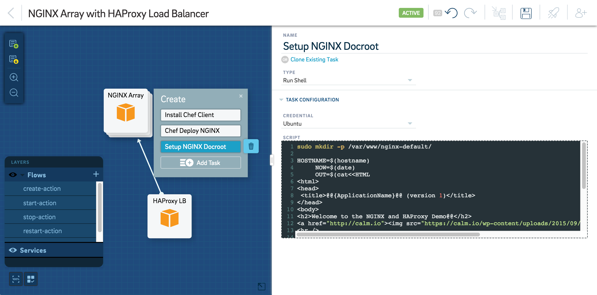

* Select **Save**. 

### Restart Nginx

* Select **Add Task**. 

2. **Name** the task. 

3. Select **Run** **Shell** as the task **Type**. 

4. Use **Ubuntu** as the **Credential**. 

5. Enter a **Script** that restarts the array service. 

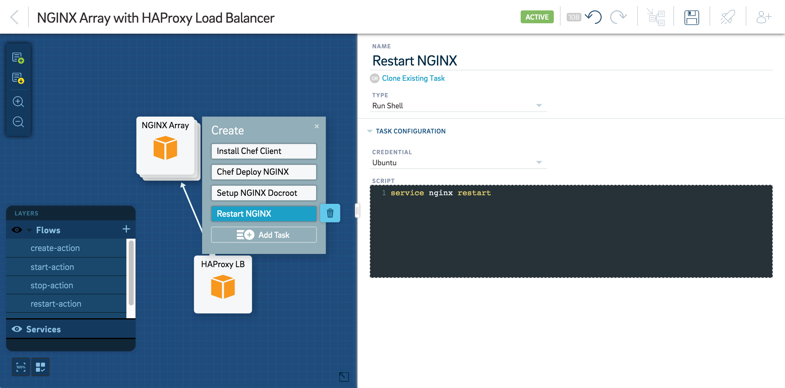

* Select **Save**. 

The HAProxy server requires a Chef installation, the use Chef cookbooks to install HAproxy on the service and an evaluation of the HAProxy configuration on the service. In order to add tasks to carry out these operations, do the following:

### Install Chef Client

* Select the HAProxy service from the blueprint canvas. 

2. Select **Add Task**. 

3. **Name** the task. 

4. Select **Clone Existing Task** and select the task that installs the Chef client from the list of tasks that are already configured. 

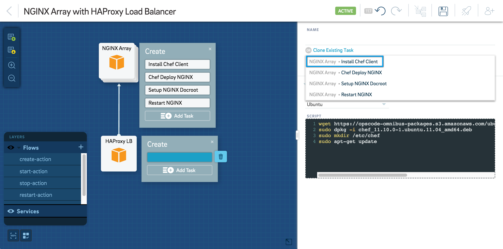

* Select **Save**. 

### Eval HAProxy Configuration

* Select **Add Task**. 

2. Select **Eval** as the task **Type**. 

3. Select **Ubuntu** as the **Credential**. 

4. Enter a script to evaluate the HAProxy configuration in the **Script** box. 

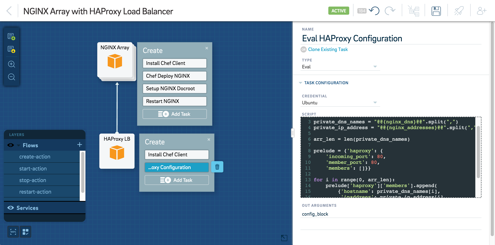

* Set the **Out Arguments** as `config_block`.

6. Select **Save**. 

### Using Chef To Deploy HAProxy on the Service

* Select **Add Task** and then **Name** it. 

2. Select **Deploy Chef** as the task **Type**.

3. Under **Task Configuration**, enter the **Node Name**.

4. Select the HAProxy **Cookbook** and its **Version**. 

5. Select a **Role** and the **Environment**. 

6. Set the **Credential** to **Ubuntu**. 
7. Set `@@{config_block}@@` as an **Attribute**. 

* Select **Save**.

Now both of your services are configured to install the required tools while they’re being provisioned. Once the provisioning is complete, you will have a fully functioning application consisting of an NGINX array and an HAProxy server. 

## Creating Flows

Once your services have been provisioned and configured to function appropriately, you will need to setup the tasks that you’d like to run on the application once it is deployed.

In this example, we will add the following flows:

* **Show Processes** to list the processes that are running on your application at any given time. 

* **Scale Up** to scale the array up by two nodes when needed. 

* **Scale Down** to scale the array down by two nodes when needed. 

* **Show HAProxy Configuration** to show the contents of the HAProxy configuration file. 

To create these flows on your blueprint, do the following:

### Adding the Show Processes Flow

* Select **+** to add a flow. 

* **Name** the flow. 

3. Choose whether the flow is **Critical**. 
!!! tip "Note"
	If a critical flow is running, any subsequent flow runs will be queued until this flow has finished executing.

* Select the NGINX array. 

5. Select **Add** **Task** and **Name** it. 

6. Select **Run** **Shell** as the task **Type** and then select **Ubuntu** as the **Credential**. 

7. Enter the **Script** to show running processes.

8. Select the HAProxy service. 

9. Select **Add** **Task** and **Name** it. 

* Select **Clone Existing Task** and select the task that shows running processes that you configured 

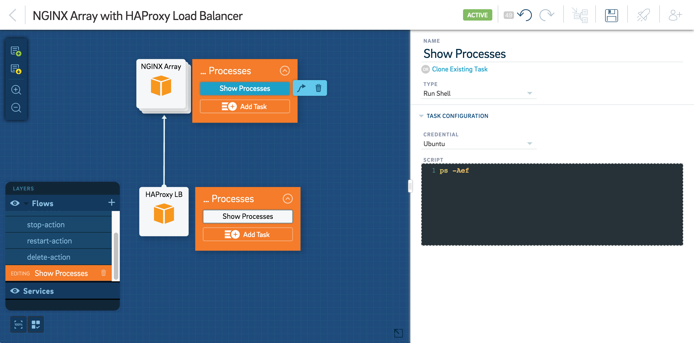

* Select **Save**. 

### Adding the Scale Up Flow

* Select **+** to add a flow. 

2. **Name** the flow. 

3. Choose whether the flow is **Critical**. 

!!! tip "Note"
	If a critical flow is running, any subsequent flow runs will be queued until this flow has finished executing.

* Select the NGINX array and then 

5. Select **Add Scale Up**.

6. Name the task and select by how many nodes you’d like to **Scale Up By**. 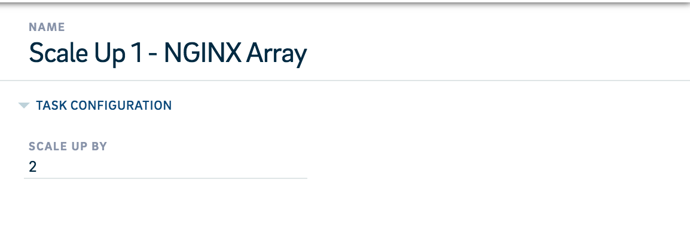

7. Select the HAProxy service and select **Add Task**. 

We will now have to add two tasks in this flow on the HAProxy service to evaluate the HAProxy configuration and then update the Chef node accordingly. 

* Name the task and select **Clone Existing Task**. 

9. Select the task that evaluates the HAProxy configuration from the list of tasks that you’ve already configured.

10. Select **Add Task**, **Name** it and select **Update Chef Node** as the task type. 

11. Enter the **Task Configuration** as shown in the figure below: 

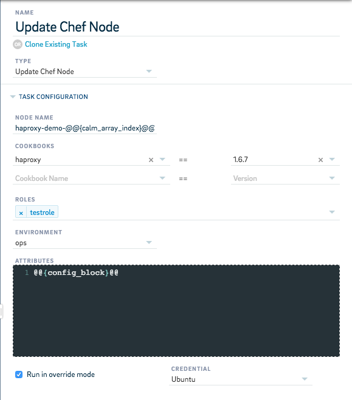

* Select  on the NGINX array and connect it with the task on the HAProxy service that evaluates the HAProxy configuration. This step ensures that the HAProxy conducts the HAProxy evaluation and updates the Chef node immediately after the NGINX array scales up. 

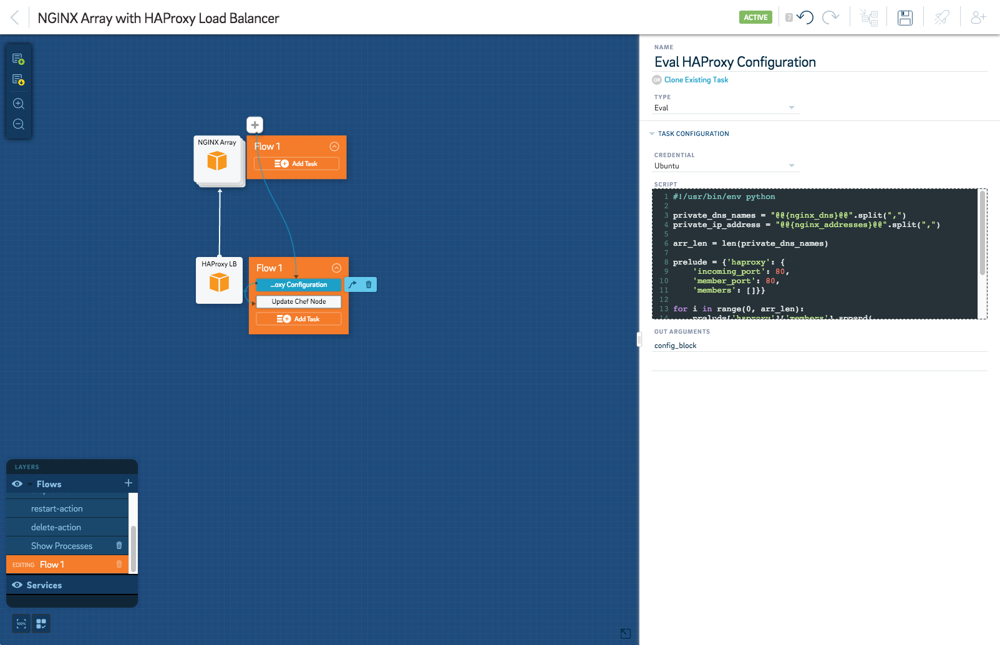

* Select **Save**. 

### Adding the Scale Down Flow

* Select **+** to add a flow. 

2. **Name** the flow. 

3. Choose whether the flow is **Critical**.
!!! tip "Note"
	If a critical flow is running, any subsequent flow runs will be queued until this flow has finished executing. 

* Select the NGINX array and then 

5. Select **Add Scale Down**.

6. Name the task and select by how many nodes you’d like to **Scale Down By**. 

7. Select the HAProxy service and select **Add Task**. We will now have to add two tasks in this flow on the HAProxy service to evaluate the HAProxy configuration and then update the Chef node accordingly. 

8. Name the task and select **Clone Existing Task**. 

9. Select the task that evaluates the HAProxy configuration from the list of tasks that you’ve already configure. 

10. Select **Add Task**, **Name** it and then select **Clone Existing Task** to clone the task that updates the Chef node.

11. Select  on the NGINX array and connect it with the task on the HAProxy service that evaluates the HAProxy configuration. 
This step ensures that the HAProxy conducts the HAProxy evaluation and updates the Chef node immediately after the NGINX array scales down. 

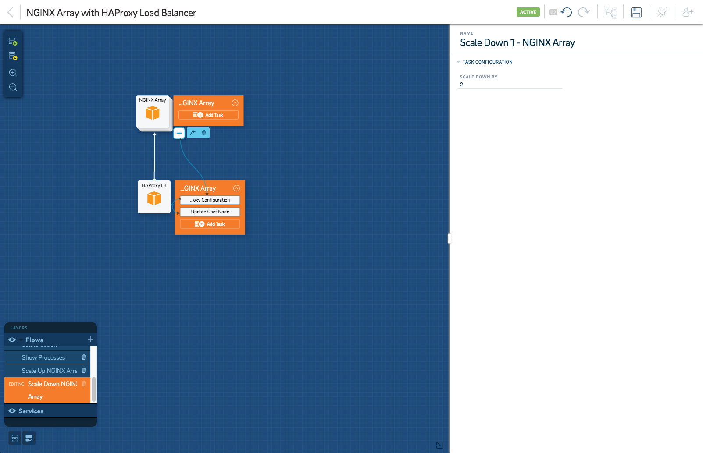

12. Select **Save**. 

### Adding the Flow That Shows the HAProxy Configuration File

* Select **+**  to add a flow. 

2. **Name** the flow. 

3. Choose whether the flow is **Critical**. 
!!! tip "Note"
	If a critical flow is running, any subsequent flow runs will be queued until this flow has finished executing.

* Select the HAProxy service. 

5. Select **Add Task**, **Name** it and select **Run Task** as the task **Type**. 

6. Select **Ubuntu** as the **Credential** and enter the script that shows the contents of the HAProxy configuration file. 

7. Select **Save**. 

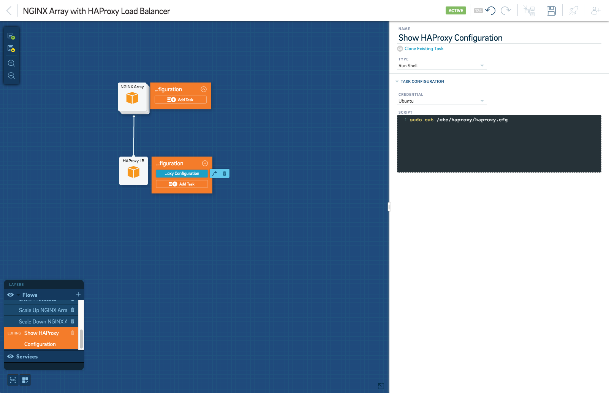

Now that we’ve added all the tasks that need to be run on your application, your blueprint is complete and ready to be executed. 

## Running Your Blueprint

Now that your blueprint is built, you can execute it to spin up your application. Before you proceed, make sure you’ve saved all of your changes by clicking Save. 

To spin up an application from your blueprint, do the following:

* Select  to run your blueprint. 

2. Enter an **Application Name** for your application. 

3. Select  to confirm whether Calm is able to communicate with the various providers that will come into play once your blueprint is executed.

4. Select  

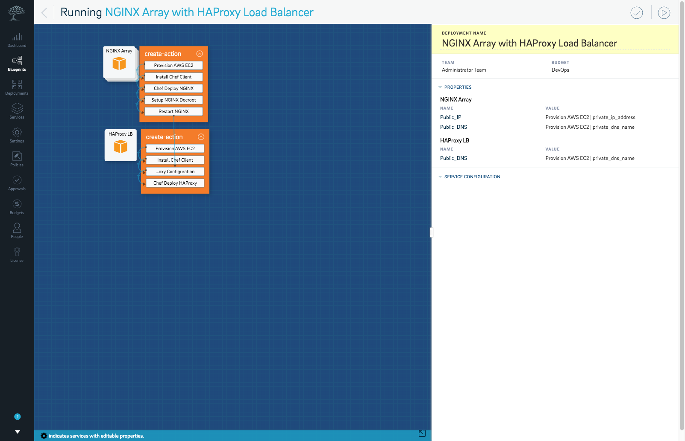

This initiates the execution of your blueprint and takes you to the **Deployments** dashboard that gives you a real-time view of your blueprint being executed. 
