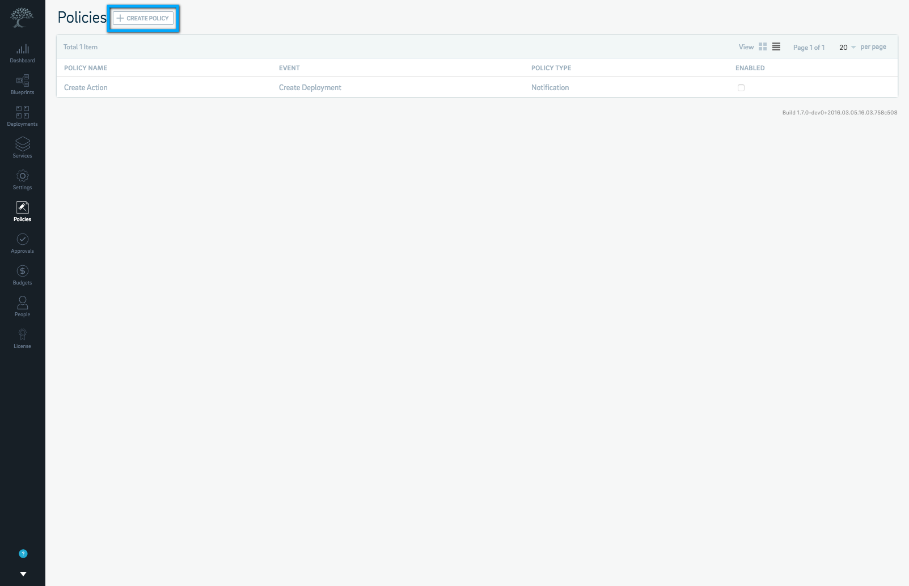
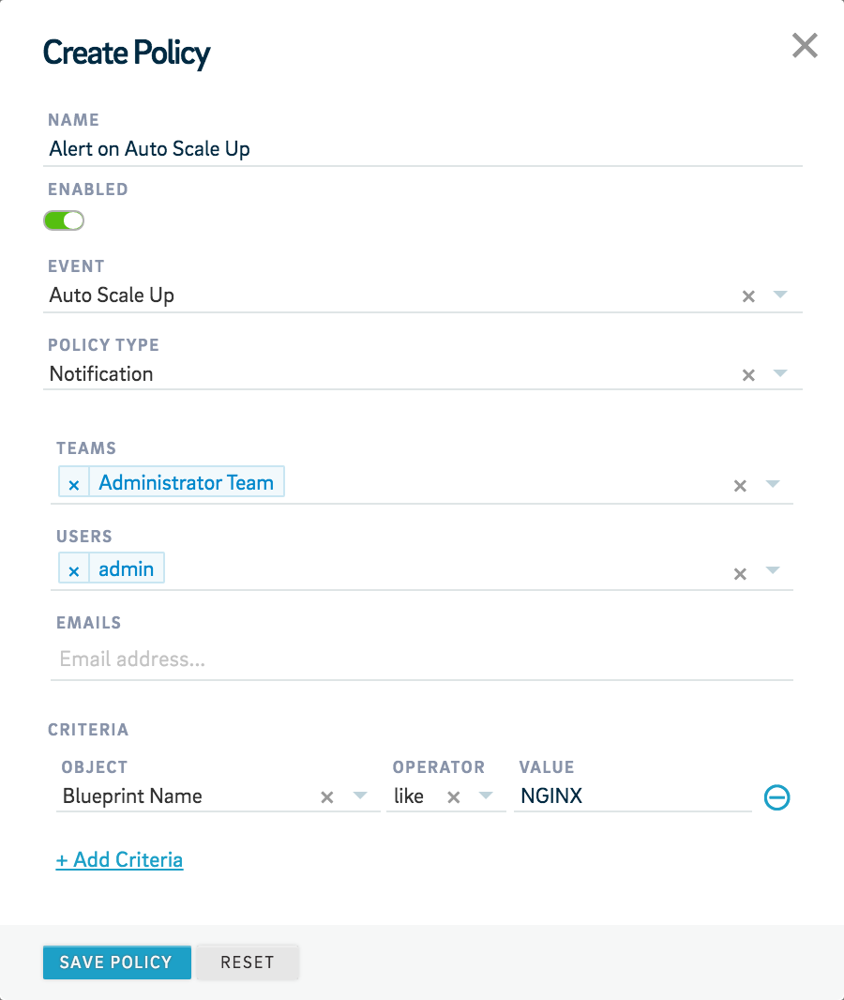
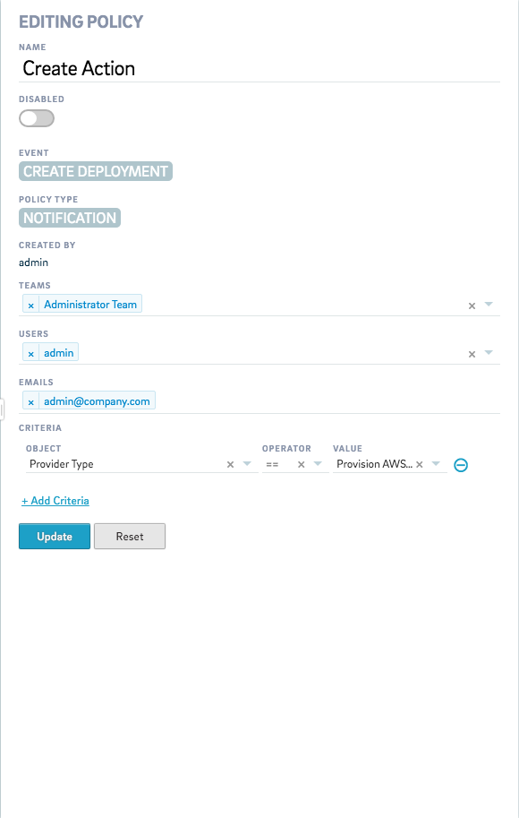

#Global Policies

Calm lets you configure a set of global Policies that lets you exercise more control over events related to scaling, deployment, flow runs, resiliency, service rollbacks and upgrades and VM actions that occur during the usage of Calm. You can set policies that enforce approval requests, notifies the administrator  or sets expiries for blueprints and deployments in Calm. 

You can access Policies by selecting Policies from the menu. You can use the Policies view to create new global Policies and edit existing ones. The types of Policies that you can create and configure are as follows:

* Approval 
* Expiry
* Notification

For more information on the Approval, Expiry and Notification policies, read [Policies and Permissions](#policies-and-permissions).

You can also pick from the following events to trigger these policies into action:

* **Auto Scale Down**
* **Auto Scale Up**
* **Create Deployment**
* **Delete Deployment**
* **Flow Run**
* **Resiliency**
* **Restart Deployment**
* **Service Rollback**
* **Service Upgrade**
* **Start Deployment**
* **Stop Deployment**
* **VM Restart**
* **VM Stop**
* **VM Restart**

The global policies that you configure need to fulfill certain **Criteria** that you can configure according to your need. For example, you can configure a **Notification** policy to send out a notification whenever a user runs a blueprint with a specific name or if the blueprint name contains certain keywords that are part of the criteria that you set. **Criteria** can be configured using **Objects**, **Operators** and **Values**. The **Objects** that you can configure for a criteria are as follows:

* **Object**
* **Blueprint Name**
* **Budget Name**
* **Deployment Name**
* **Provider Type**
* **Settings Name**
* **Task Name**
* **Task Type**
* **Team Name**
* **User Name**

The **Operators** that you can use to configure your criteria are as follows:

* **like**: Used to search for all objects that match the specified pattern (Perl style regular expression) as the value for the attribute. The **like** operator is case-sensitive. 
* **notlike**: Used to search for all objects that don't match the specified pattern (Perl style regular expression) as the value for the attribute. The **notlike** operator is case-sensitive. 
* **ilike**: Used to search for all objects that match the specified pattern (Perl style regular expression) as the value for the attribute. The **ilike** operator is not case-sensitive. 
* **==**: Used to search for all objects that match the exact specified value for the attribute. The **==** operator is case-sensitive.
* **!=**: Used to search for all objects that don't match the exact specified value for the attribute. The **!=** operator is case-sensitive.

## Adding a Global Policy

To add a new global Policy, do the following:

* Select **Create Policy** on the **Policies** page.

* Give it a **Name**.
* Choose whether you'd like to enable it by default by using the toggle button under **Enabled**.
* Select the **Event** for which you'd like to set a global policy. 
* Select the **Policy Type** for the policy that you're setting. 
* Select the **Teams**, **Users** and **Email addresses** to send a request or notification.
* Set the **Criteria** to trigger the policy by choosing an appropriate **Object**, **Operator** and **Value**. 
* Select **Add Criteria**, to add another criteria. Else, select **Save Policy** to save the policy. You can also reset the form and re-configure your policy by selecting **Reset**.

Your new global polocy will now be set. 

## Editing a Global Policy

To edit a global policy, do the following:

* Select the policy that you'd like to edit. 
* Use the toggle button to enable or disable the policy. 
* Add or remove **Teams**, **Users** or **Email** addresses using the appropriate dropdown menus. 
* Edit or add new criteria from the **Criteria** subsection. You can remove criteria by clicking  next to the **Criteria** that you'd like to delete. 
* Click **Update** to update the policy. Click **Reset** if you'd like to reset the changed values of the policy to the default ones. 

