# The Calm Language

The terminology that you will come across while using Calm and this document are listed and explained in this chapter. It is advisable to go through this list before you proceed with using Calm in order to better understand the context of their usage, what they mean and how they relate to the various components in Calm. 

Calm helps you automate your provisioning and deployment steps across multiple providers. For instance, provisioning a development environment might involve provisioning EC2 instances, pulling code from github, installing pre-requisites and configuring a deployment. In Calm, you will define a **blueprint** describing the deployment and its dependencies. Running the blueprint results in a **deployment** which is an instantiated version of the blueprint. You can also define well-defined tasks such as taking backups and these **flows** will be available in each deployment.

Calm can also model your organisation structure as **teams** and can define **budgets** and access control for these teams. It also allows you to model human interactions such as **approvals** and **notifications**. It can serve as a self-service portal for users or as a orchestration platform and can be integrated into your existing tools like Jenkins and Chef for higher level automation.

## Blueprint

A **Topology** in Calm is similar to server topology diagrams that help you visualize the various components in your architecture and their dependencies . They represent basic machine configurations, dependencies and resource allocations for the deployments that you’re building using Calm. 

You can use **Topology** to build the architecture of your deployment, the way you intend to. You can build single-resource as well as clustered topologies that support the most complex of your production environments. 

## Services

**Services** are virtual machine instances, existing machines or bare-metal machines that you are provisioning and configuring using Calm. You can choose to either provision single service instances or multiple services based on the topology of your deployment. 

## Arrays

You can also provision an **array** of identical services with identical configuration using Calm. This means that instead of configuring a large number of services with an identical configuration individually, you can bring them up simultaneously by configuring an array service.

## Variables

**Variables** are properties associated with the services that you provision in your blueprints such as IP addresses, DNS names, instance IDs, etc. They can be static, provided at run time or generated during blueprint or flow runs.

## Dependencies

**Dependencies** are used to define the dependence of one service in your deployment on another or several other services for properties such as IP addresses, DNS names, etc. Dependencies are used to define the order in which tasks need to be executed. The direction of the arrows defines the direction of execution. If there are no dependencies between tasks in a service, the engine will assume it is free to execute them in any order or even in parallel. 

## Properties

**Properties** are a set of variables that are defined on a service either during provisioning or while running a task or a flow. These properties are emitted from another service such as the public or private IP address. In order to be accessed by other services in the blueprint, these properties will have to be defined.

You can also create runtime editable properties while configuring a task in a flow. 

## Deploy Task

A **Deploy** **Task** is an operation that you can run on your services once they are provisioned. These tasks will be run one after the other. These tasks are part of the creation process of your deployment and can be used to perform a variety of operations such as setting up your environment, deploying a Chef node on your service or installing a set of software on your service.  

## Flows

**Flows** are a set of operations that you can run on your deployments, which are the result of running the blueprint. There are predefined flows that instantiate services, but you can create your own custom flows to carry out operations as per your need. The predefined flows are listed below:

* **Create-action flow** is essentially the first task that is carried out while running your blueprint. It defines the operation of provisioning the machines that constitute your deployment architecture and conducts all the operations related to the creation of your deployment. 

* **Delete-action flow** deletes the entire deployment at the end of its lifecycle. This flow occurs either on expiry as defined in the expiry policy or when manually deleted by you from the **Deployments** page. 

* **Scale Up flow** adds another instance of a service to an array of services. This flow is useful in situations where your deployment needs the functioning of an additional instance beyond those that you’ve already configured. On activation, a scale up flow adds an identical instance and runs the same set of tasks that have been configured on the array in the blueprint. The number of instances to be added to the array can be specified while configuring the flow. You can also customize a scale up flow to conduct an additional set of tasks on the newly provisioned service. 

* **Scale Down flow** removes an instance of a service from an array of services. This flow is useful in situations where your deployment does not require the services of any additional instances that are part of an array. This flow can remove any number of instances based on your specification up until there is only one instance left in the array. 
You can also customize a scale down flow to run a set of tasks on the services before they are deleted. 

* **VM Action flows** lets you start, stop or restart a service that is part of an deployment at any given instant. These flows can be accessed by selecting the deployment from the **Deployments** page and then **Services**. For more information, read **Start/Stop/Restart a Service** under [Managing Deployments](#managing-deployments) 

## Credentials

**Credentials** are the set of credentials that you will use to access machines that are provisioned after running your blueprint. These credentials will be used by Calm to connect to your services with the same privileges as the user and run scripts and tasks on the service. 

# Policies and Permissions

**Policies** in Calm are a set of rules and guidelines that you can impose upon your blueprints and deployments. They help you govern over who gets to do what action using Calm. Calm currently provides the following set of policies:

* **Expiry**
* **Approval**
* **Notification**
* **Autoscale**
* **Resiliency**
* **Deployment**

## Expiry Policy

**Expiry** lets you set an expiry for your deployment. You can choose from either;

* **No Expiry**, where your blueprint is set to never expire. 

* **Date Field**, where your blueprint is set to expire on a particular date. 

* **Time Delta**, where your blueprint is set to expire by the end of a particular time period. 

## Approval Policy

**Approvals** lets you initiate an approval request for a blueprint that you create or delete. You can choose to set an approval for whenever a blueprint is created or before it is deleted. When configured, this policy sends out an approval request, to create or delete a blueprint, to the teams and users that you’ve chosen to approve the blueprint. You can also specify email addresses to which the approval request is to be sent. 

## Notification Policy

**Notifications** lets you notify a particular team whenever a blueprint is created or deleted. You can choose to send out a notification for whenever a blueprint is created or deleted. You can also specify email addresses to which you would like to send out such notifications. 

You can access and configure policies while building your blueprint by clicking on the **Policies** tab.

## Autoscale Policy

**Autoscale** policies trigger an **Autoscale Up** or **Autoscale Down** on the array services that you configure it for. **Autoscale** policies work best when you configure your own monitoring system to hit a **Calm API endpoint** with certain parameters on experiencing high loads for an **Autoscale Up** and low loads for an **Autoscale Down**. 

An **Autoscale** policy can be configured on an array while building a blueprint from the **Policies** tab on the blueprint editor. 

Configuring an **Autoscale** policy consists of the following:

* **Alert Count**: The threshold number of alerts that need to be hit before the Autoscale is triggered. 
* **Alert Window (In Minutes)**: The time within which the threshold number of alerts need to be received. 
* **Scale By**: The number of services the array needs to be scaled by. 
* **Min**: The minimum number of services that need to remain on the array after an Autoscale Down.
* **Max**: The maximum number of services that can be added to an array by executing an Autoscale Up.
* **Pre Flow**: The set of tasks that need to be executed on the array before Autoscale kicks in. 
* **Post Flow**: The set of tasks that need to be executed on the array after the Autoscale is performed. 

An example of an Autoscale policy configuration is shown below:

Once all of the above components of the policy have been configured, you need to configure your monitoring system to hit the Calm API endpoint with a `GET` request for it to be able to trigger the **Autoscale** policy, when necessary. 

The Calm API endpoints to be hit are as follows:

* For high loads and a subsequent autoscale up: `http://CALM_URL/externalalerts/load_high`
* For low loads and a subsequent autoscale down: `http://CALM_URL/externalalerts/load_low`

The parameters that need to be sent along with the request are:

* `instance_id`, and/or;
* `instance_ip`

!!! tip "Note"
    All API requests made to the Calm API endpoints need to have basic authentication.

## Resiliency Policy 
**Resiliency** policies trigger resiliency on services that go down unexpectedly. This policy can be triggered either internally, using Calm's service sync, or externally, using an external monitoring system. 

A **Resiliency** policy can be configured on any service while building a blueprint from the **Policies** tab on the blueprint editor. 

Configuring an **Resiliency** policy consists of the following:

* **Alert Count**: The threshold number of alerts that need to be hit before the **Resiliency** is triggered. 
* **Alert Window (In Minutes)**: The time within which the threshold number of alerts need to be received. 

!!! tip "Note"
	Always ensure that the Alert Window is **greater than** the **Alert Count** multiplied by the **Resource Sync Interval** that you've configured while coniguring virtualization providers in Calm. 

* **Pre Flow**: The set of tasks that need to be executed on the node before resiliency kicks in. 

!!! tip "Note"
	The **Pre Flow** runs after the corresponding service goes down so that you can reconfigure all the services that are dependant on the service that failed. 
	
* **Post Flow**: The set of tasks that need to be executed on the array after the resiliency is performed. 

!!! tip "Note"
	The **Post Flow** always runs after the service that has been brought up as a result of the Resiliency policy is up and running. 

* **Event Source**: This needs to be set to **internal**, when using Calm's service sync or **external**, when using an external monitoring system. 

An example of an **Resiliency** policy configuration is shown below:

Once all of the above components of the policy have been configured, you need to configure your monitoring system to hit the Calm API endpoint with a `GET` request for it to be able to trigger the **Resiliency** policy, when necessary. 

The Calm API endpoint to be hit is as follows:

`http://CALM_URL/externalalerts/load_high`

The parameter that needs to be sent along with the request is:

* `instance_ip`

!!! tip "Note"
    All API requests made to the Calm API endpoints need to have basic authentication.

## Deployment Policy

The **Deployment** policy lets you govern how upgrades and rollbacks on your array services are carried out. This policy lets you carry out two types of upgrades:

* Rolling Upgrade, where the services in the array being upgraded are divided into batches based on the Rolling Factor, and upgraded in succession. 
* Canary Upgrade, which is a variant of Rolling upgrades, where an Initial Count of machines on the array to be upgraded is set. 

A **Deployment** policy can be configured on any array while building a blueprint from the **Policies** tab on the blueprint editor. 

Configuring a **Deployment** policy consists of the following:

* **Upgrade Type**: Whether Rolling or Canary. 
* **Initial Count** (in case of Canary upgrade): The first subset of services on the array that will be upgraded. 
* **Rolling Factor**: The number of iterations and number of services on which the new version of code will be deployed, if the upgrade is successful on the initial set.
* **Pre Flow**: The set of tasks to be executed on the services before the upgrade flow takes place in every iteration of the upgrade cycle. 
* **Upgrade Flow**: The set of tasks that carry out the upgrade of the services. 
* **Post Flow**: The set of tasks to be executed on the services after the upgrade flow takes place in every iteration of the upgrade cycle.
* **Rollback Flow**: The set of tasks to be executed on the upgraded services in case the upgrade fails. 
* **Rollback Pre Flow**: The set of tasks to be executed on the services after the upgrade flow takes place in every iteration of the upgrade cycle.
* **Rollback Post Flow**: The set of tasks to be executed on the services after the upgrade flow takes place in every iteration of the upgrade cycle.
* **Initial Version**: The initial version of the code being deployed on the services as part of the upgrade. 
* **Approval**: Approvals can be configured as part of the Deployment policy in order to seek for approvals from teams and users to continue with the upgrade after the first subset of services have been upgraded. This helps users to test the upgrade and then provide their approval to proceed with the upgradation of the rest of the services.

An example of a **Deployment** policy configuration is shown below:

 

## Permissions 

**Permissions**, on the other hand, lets you decide which teams and users have access to each individual blueprint and budgets that are created using Calm. If no permissions are assigned while creating a blueprint, every team has access to that particular blueprint. If permissions are assigned to a particular team, every user in that team will have access to the blueprint. 

# Signing In

The first step towards using Calm is signing into your Calm dashboard. In order to do so, you would need the following:

* Calm installed on your machine. If you haven’t installed Calm yet or need help in installing it, view the Calm Installation Guide. 

* A superadmin, admin or user account and valid credentials for it. 

!!! tip "Note"
    By default, a superadmin user is created with every installation of Calm. The default credentials are:

    **Username**: admin

    **Password**: admin

If you’re not a superadmin user, please use the credentials provided to you by your Calm Administrator.

To sign in to your Calm dashboard, do the following:

* Navigate to the IP address or the DNS of the machine you have installed Calm on in your favourite browser.

* Enter your Calm **Username** and **Password**. 

3. Select **Login**. 

You will now have access to Calm’s supercharged and easy-to-use dashboard. 

# Using the Calm Interface

The Calm interface has been aesthetically designed to help you use all the functions and features of Calm with the greatest of ease. The dashboard has been ergonomically split into menus, dashlets, pages and sections that let you navigate through various features and achieve a variety of functions. 

The main Calm dashboard that you’ll see after signing into your Calm account is as shown in the image below:

The main dashboard consists of several dashlets that contain the following information related to your Calm account:

* **Blueprint Runs** depicts the count of deployments that have been created out of Blueprints. The graph view can also be filtered by the Teams. 

2. **Budget** **Consumption** depicts the overall budget that you’ve assigned to Teams defined in Calm and its utilization. The pie chart is split amongst Deployments based on the percentage they consume of the overall budget item. If you have defined more than one budget, you can view the consumption of each budget by selecting the budget from the drop-down menu. 

3. **Resource Summary**provides an overview of the various providers that you’ve configured with in Calm. It gives you a snapshot of the number of resources under each provider. You can also filter this view by provider specific criteria such as availability zones (if you’ve configured AWS) and IP address (if you’ve configured vCenter). 

4. **Deployments** shows a list of the last five deployments that were spun off of your blueprints using Calm. 

5. **Blueprints** shows a list of the last five blueprints that were built using Calm. 

It also contains a navigation menu on the left of the window that lets you access and use the various features and functions in Calm. 

Select the the **Calm logo** on the top-left corner brings you to the main dashboard. You can also access the main dashboard by clicking the dashboard icon. 

Selecting any of the other feature icons on the menu takes you to a feature page for that respective feature. These pages will usually contain items that relate to that particular feature. You can toggle between a list view  and a grid view for these items. Items on the feature pages will get paginated as and when they are accumulated. Each page carries 20 items by default. You can also choose to view 10, 50, 75 or 100 items per page based on your requirement. 

Selecting an item on a feature page will open up a panel on the right containing information about that item. Some of these information can be edited within this panel for features such as Budgets and People. 

You can seek troubleshooting or user assistance while using Calm at any time by clicking on  on the bottom left corner of the Dashboard. You can also view your Account options or sign out from Calm by clicking on **_ _**.

# Configuring Calm

Before you start using Calm, you’d have to configure it correctly so that it syncs with the virtualization layers, build tools and deployment tools that you use and lets you spin up deployments from the resources they provide. Configuring Calm isn’t a difficult process. But before you begin, you would need the following:

* Network access from Calm to the Provider you wish to configure

* Access details to connect to the provider

!!! tip "Note"
	Calm currently supports out-of-the-box integrations with **AWS**, **OpenStack**, **Docker**, **vCenter**, **XenServer** and **Nutanix**. You can also integrate your own custom providers with Calm, provided you have valid credentials and the requisites to carry out the integration. Calm also supports integrations with your ow private **Docker Registry**, thus enabling you to pull images from it and containerise them. 

* Access to any of the popular deployment automation tools such as **Salt**, **Puppet** or **Chef** (optional).

* Access to a continuous integration and deployment tool (optional).

!!! tip "Note"
	Calm currently supports out-of-the-box integration with **Jenkins**.	

## Configuring Your Virtualization Platform

You will have to configure Calm with your virtualization provider credentials in order to use Calm to manage and deploy deployments using your virtualization resources. You can configure more than one virtualization provider or several accounts of the same provider, if you choose to do so. 

Pick your virtualization provider from the following options to view explicit instructions for configuring them with Calm. 

[Amazon Web Services](#configuring-aws-credentials-on-calm)

[Openstack](#configuring-calm-with-openstack)

[Docker](#configuring-calm-with-docker)

[vCenter](#configuring-calm-with-vcenter)

[XenServer](#configuring-calm-with-xenserver)

[Nutanix](#configuring-calm-with-nutanix)

[Custom Provider](#configuring-calm-with-your-custom-provider)

## Configuring AWS Credentials on Calm

### Before You Begin

Before you begin configuring Calm with AWS, you’ll need the following:

* An AWS account with valid credentials

* An IAM user account. To know more about creating an IAM user on AWS, go to [http://docs.aws.amazon.com/IAM/latest/UserGuide/id_users_create.html](http://docs.aws.amazon.com/IAM/latest/UserGuide/id_users_create.html). The user account needs to have the **EC2FullAccess** and **IAMRoleAdmin** privileges.

* The Access Key ID and the Secret Access Key for your IAM user account with AWS. 

* Calm deployed from our AWS AMI.

### Instructions

To configure Calm with AWS, do the following:

* Select **Settings** from the Calm menu. 

2. Select the **Virtualization** tab and then **Add** **Provider**. 

3. Select **AWS** from the **Type** drop-down menu. 

4. Give your configuration a **Name**. 

5. Enter the **Resource Sync Interval** in minutes. 

6. Enter the **Access** **Key** **ID** and the **Secret** **Access** **Key** associated with your **AWS** user account. 

7. Select **Save**. 

8. Select the **Availability** **Regions** from the drop-down menu. The users of Calm will only be able to deploy instances in the selected **Availability** **Regions**. 

9. You can also search for and select the AMIs that will be available to create instances using Calm for each **Availability** **Region** that you’ve selected.

!!! tip "Note"
	AMIs in your **My AMIs** list in the selected **Availability** **Region** will also be available to users.
    
* Select **Save** and then **Verify**. 

Once the configuration has been saved and verified, you will be able to use Calm to spin up instances and deploy deployments using your AWS AMIs. 

You can repeat the instructions above to configure another set of AWS credentials. 

To configure Calm with another provider, pick the provider from the options below for provider specific instructions.

[Openstack](#configuring-calm-with-openstack)

[Docker](#configuring-calm-with-docker)

[vCenter](#configuring-calm-with-vcenter)

[XenServer](#configuring-calm-with-xenserver)

[Nutanix](#configuring-calm-with-nutanix)

[Custom Provider](#configuring-calm-with-your-custom-provider)

To continue and configure Calm with your Deployment tools, click [here](#configuring-your-deployment-tools).

To configure Calm with Jenkins, click [here](#configuring-calm-with-jenkins).

To configure Calm with your private Docker Registry, click [here](#configuring-calm-with-your-docker-registry)

## Configuring Calm with Openstack

### Before Your Begin

Before you begin configuring Calm with Openstack, you’ll need the following:

* An Openstack account with valid credentials.

* The OpenStack auth URL

### Instructions

To configure Calm with Openstack, do the following:

* Select **Settings** from the Calm menu. 

2. Select the **Virtualization** tab and then **Add** **Provider**. 

3. Select **Openstack** from the **Type** drop-down menu. 

4. Give your configuration a **Name**. 

5. Enter a **Resource Sync Interval**. 

6. Select the **Keystone API Version** corresponding to your OpenStack setup from the drop-down menu.

7. Enter your Openstack **Username**, **Password** and **Auth** **URL**.

8. Optionally, enter a project **Name**, **User** **Domain Name** and **Project Domain Name**.

 

* Select **Save** and then **Verify**.

Once the configuration has been saved and verified, you will be able to use Calm to spin up instances and deploy deployments using your Openstack resources. 

You can repeat the instructions above to configure another set of Openstack credentials. 

To configure Calm with another provider, pick the provider from the options below for provider specific instructions.

[Amazon Web Services](#configuring-aws-credentials-on-calm)

[Docker](#configuring-calm-with-docker)

[vCenter](#configuring-calm-with-vcenter)

[XenServer](#configuring-calm-with-xenserver)

[Nutanix](#configuring-calm-with-nutanix)

[Custom Provider](#configuring-calm-with-your-custom-provider)

To continue and configure Calm with your Deployment tools, click [here](#configuring-your-deployment-tools).

To configure Calm with Jenkins, click [here](#configuring-calm-with-jenkins).

To configure Calm with your private Docker Registry, click [here](#configuring-calm-with-your-docker-registry)

## Configuring Calm with Docker

### Before Your Begin

Before you begin configuring Calm with Docker, you’ll need the following:

* A Docker account with valid credentials.

### Instructions

To configure Calm with Docker, do the following:

* Select **Settings** from the Calm menu. 

2. Select the **Virtualization** tab and then **Add** **Provider**. 

3. Select **Docker** from the **Type** drop-down menu. 

4. Give your configuration a **Name**. 

5. Enter a **Resource Sync Interval**. 

6. Enter the TCP port details under **Host**. 

7. Select **Save** and then **Verify**. 

Once the configuration has been saved and verified, you will be able to use Calm to spin up instances and deploy deployments using your Docker resources. 

You can repeat the instructions above to configure another set of Docker credentials. 

To configure Calm with another provider, pick the provider from the options below for provider specific instructions.

[Amazon Web Services](#configuring-aws-credentials-on-calm)

[Openstack](#configuring-calm-with-openstack)

[vCenter](#configuring-calm-with-vcenter)

[XenServer](#configuring-calm-with-xenserver)

[Nutanix](#configuring-calm-with-nutanix)

[Custom Provider](#configuring-calm-with-your-custom-provider)

To continue and configure Calm with your Deployment tools, click [here](#configuring-your-deployment-tools).

To configure Calm with Jenkins, click [here](#configuring-calm-with-jenkins).

To configure Calm with your private Docker Registry, click [here](#configuring-calm-with-your-docker-registry)

## Configuring Calm with vCenter

### Before Your Begin

Before you begin configuring Calm with vCenter, you’ll need the following:

* A vCenter account with valid credentials.

### Instructions

To configure Calm with vCenter, do the following:

* Select **Settings** from the Calm menu. 

2. Select the **Virtualization** tab and then **Add** **Provider**. 

3. Select **vCenter** from the **Type** drop-down menu. 

4. Give your configuration a **Name**. 

5. Enter a **Resource Sync Interval**. 

6. Enter your vCenter IP address. 

7. Enter your vCenter **Username** and **Password**.

8. Select a **Data** **Center**.

9. Enter the vCenter **Customization** **Specification**. 

10. Select **Save** and then **Verify**. 

Once the configuration has been saved and verified, you will be able to use Calm to spin up instances and deploy deployments using your vCenter resources. 

You can repeat the instructions above to configure another set of vCenter credentials. 

To configure Calm with another provider, pick the provider from the options below for provider specific instructions.

[Amazon Web Services](#configuring-aws-credentials-on-calm)

[Openstack](#configuring-calm-with-openstack)

[Docker](#configuring-calm-with-docker)

[XenServer](#configuring-calm-with-xenserver)

[Nutanix](#configuring-calm-with-nutanix)

[Custom Provider](#configuring-calm-with-your-custom-provider)

To continue and configure Calm with your Deployment tools, click [here](#configuring-your-deployment-tools).

To configure Calm with Jenkins, click [here](#configuring-calm-with-jenkins).

To configure Calm with your private Docker Registry, click [here](#configuring-calm-with-your-docker-registry)

## Configuring Calm with XenServer

### Before Your Begin

Before you begin configuring Calm with XenServer, you’ll need the following:

* A XenServer account with valid credentials.

### Instructions

To configure Calm with Openstack, do the following:

* Select **Settings** from the Calm menu. 

2. Select the **Virtualization** tab and then **Add** **Provider**. 

3. Select **XenServer** from the **Type** drop-down menu. 

4. Give your configuration a **Name**. 

5. Enter a **Resource Sync Interval**. 

6. Enter your XenServer **Username**, and **Password**.

7. Select **Save** and then **Verify**. 

Once the configuration has been saved and verified, you will be able to use Calm to spin up instances and deploy deployments using your XenServer resources. 

You can repeat the instructions above to configure another set of XenServer credentials. 

To configure Calm with another provider, pick the provider from the options below for provider specific instructions.

[Amazon Web Services](#configuring-aws-credentials-on-calm)

[Openstack](#configuring-calm-with-openstack)

[Docker](#configuring-calm-with-your-docker-registry)

[vCenter](#configuring-calm-with-vcenter)

[Nutanix](#configuring-calm-with-nutanix)

[Custom Provider](#configuring-calm-with-your-custom-provider)

To continue and configure Calm with your Deployment tools, click [here](#configuring-your-deployment-tools).

To configure Calm with Jenkins, click [here](#configuring-calm-with-jenkins).

To configure Calm with your private Docker Registry, click [here](#configuring-calm-with-your-docker-registry)

## Configuring Calm with Nutanix

### Before Your Begin

Before you begin configuring Calm with Nutanix, you’ll need the following:

* A Nutanix account with valid credentials.

### Instructions

To configure Calm with Openstack, do the following:

* Select **Settings** from the Calm menu. 

2. Select the **Virtualization** tab and then **Add** **Provider**. 

3. Select **Nutanix** from the **Type** drop-down menu. 

4. Give your configuration a **Name**. 

5. Enter a **Resource Sync Interval**. 

6. Enter the node details for your Nutanix machine. 

7. Enter your Nutanix **User** and **Password**.

8. Select **Save** and then **Verify**. 

Once the configuration has been saved and verified, you will be able to use Calm to spin up instances and deploy deployments using your Nutanix resources. 

You can repeat the instructions above to configure another set of Nutanix credentials. 

To configure Calm with another provider, pick the provider from the options below for provider specific instructions.

[Amazon Web Services](#configuring-aws-credentials-on-calm)

[Openstack](#configuring-calm-with-openstack)

[Docker](#configuring-calm-with-your-docker-registry)

[vCenter](#configuring-calm-with-vcenter)

[XenServer](#configuring-calm-with-xenserver)

[Custom Provider](#configuring-calm-with-your-custom-provider)
 

To continue and configure Calm with your Deployment tools, click [here](#configuring-your-deployment-tools).

To configure Calm with Jenkins, click [here](#configuring-calm-with-jenkins).

To configure Calm with your private Docker Registry, click [here](#configuring-calm-with-your-docker-registry)

## Configuring Calm with Your Custom Provider

Custom providers can be used to model providers that are not available in Calm. For example, if you use Proxmox you need to write two scripts, one which can create an instance and one which can delete a given instance. You can see an example script at <some url here>.

### Before Your Begin

Before you begin configuring Calm with your custom provider, you’ll need the following:

* An account with valid credentials for your custom provider.

### Instructions

To configure Calm with a custom provider, do the following:

* Select **Settings** from the Calm menu. 

2. Select the **Virtualization** tab and then **Add** **Provider**. 

3. Select **Custom Provider** from the **Type** drop-down menu. 

4. Give your configuration a **Name**. 

5. Enter a **Resource Sync Interval**. 

6. Enter the **Address**, **Port** and **Username**. 

7. Set the authentication to either **Password** or **SSH Key**. 

8. Enter the **Password** or **SSH Key** based on your selection in step **7**. 
You can also upload your SSH key by clicking the **Upload** button.

9. Set the **Parameters** to be used in your provision script. 

10. Enter the **Provision** **Script** in the code box. 

11. Set the parameters for your **Out** **Arguments**. 

12. Enter the **Delete** **Script**. 

13. Select **Save** and then **Verify**. 

Once the configuration has been saved and verified, you will be able to use Calm to spin up instances and deploy deployments using the resources provided by your custom provider. 

You can repeat the instructions above to configure another custom provider’s credentials. 

To configure Calm with another provider, pick the provider from the options below for provider specific instructions.

[Amazon Web Services](#configuring-aws-credentials-on-calm)

[Openstack](#configuring-calm-with-openstack)

[Docker](#configuring-calm-with-your-docker-registry)

[vCenter](#configuring-calm-with-vcenter)

[XenServer](#configuring-calm-with-xenserver)

[Nutanix](#configuring-calm-with-nutanix)

To continue and configure Calm with your Deployment tools, click [here](#configuring-your-deployment-tools).

To configure Calm with Jenkins, click [here](#configuring-calm-with-jenkins).

To configure Calm with your private Docker Registry, click [here](#configuring-calm-with-your-docker-registry)

## Configuring Your Deployment Tools

Calm is designed to work well with popular deployment tools such as Chef, Puppet and Salt. If you’re deployments require the use of any of these tools to run specific tasks on them, you can configure Calm to connect to these services and work with them. 

To configure your deployment tool with Calm, pick the tool that you use from those listed below to view tool specific configuration instructions:

[Chef](#configuring-calm-with-chef)

[Puppet](#configuring-calm-with-puppet)

[Salt](#configuring-calm-with-salt)

## Configuring Calm With Chef

Calm can connect to an existing Chef server with the in-built Chef integration. On configuring Calm to work with your Chef account, Calm will use Chef in server mode and not in solo mode. The recipes that are in version control will need to be made available to Chef in order for Calm to be able to retrieve recipes and use them in you blueprints. 

### Before You Begin

Before you begin configuring Calm with Chef, you’ll need the following:

* Valid credentials for Chef

* Chef Private Key and Validation Key

### Instructions

To configure Calm with Chef, do the following:

* Select the **Deploy** tab. 

2. Select **Add Provider**. 

3. Select **Chef** from the **Type** drop-down list. 

4. Give your configuration a **Name**. 

5. Enter your **Chef** **Server** address and the **User**. 

6. Enter the **Private** **Key** and **Validation Key**. You can also upload these keys by clicking the **Upload** button.

7. Enter the name of the **Chef Validation Client**. 

8. Select **Save** and then **Verify**. 

Calm will now be configured with your Chef credentials and is ready to work with your Chef server. Your new configuration will be listed by the name you’ve given it under the Deploy tab. 

You can delete an existing configuration by selecting it from the list of configurations and clicking on Delete. 

You can repeat these instructions to add another Chef configuration if you’d like to. To configure Calm with another deployment tool, pick the provider from the options below for provider specific instructions.

[Puppet](#configuring-calm-with-puppet)

[Salt](#configuring-calm-with-salt)

To configure Calm with Jenkins, click [here](#configuring-calm-with-jenkins).

To configure Calm with your private Docker Registry, click [here](#configuring-calm-with-your-docker-registry)

## Configuring Calm With Puppet

### Before You Begin

Before you begin configuring Calm with Puppet, you’ll need the following:

* Valid credentials for Puppet

### Instructions

To configure Calm with Puppet, do the following:

* Select the **Deploy** tab. 

2. Select **Add Provider**. 

3. Select **Puppet** from the **Type** drop-down list. 

4. Give your configuration a **Name**. 

5. Enter the **Host** details and the **Puppet** **Username**.

6. Set the authentication to either **Password** or **SSH** **Key**. 

7. Enter the **Password** or **SSH** **Key**, based on your selection in step **7**. You can also upload your **SSH** **Key** by clicking

8. Enter the **SSH** **Port**.

9. Select **Save** and then **Verify**. 

Calm will now be configured with your Puppet credentials and is ready to work with your Puppet server. Your new configuration will be listed by the name you’ve given it under the Deploy tab. 

You can delete an existing configuration by selecting it from the list of configurations and clicking on **Delete**. 

You can repeat these instructions to add another Puppet configuration if you’d like to. To configure Calm with another deployment tool, pick the provider from the options below for provider specific instructions.

[Chef](#configuring-calm-with-chef)

[Salt](#configuring-calm-with-salt)

To configure Calm with Jenkins, click [here](#configuring-calm-with-jenkins).

To configure Calm with your private Docker Registry, click [here](#configuring-calm-with-your-docker-registry)

## Configuring Calm With Salt

### Before You Begin

Before you begin configuring Calm with Salt, you’ll need the following:

* Valid credentials for Salt

### Instructions

To configure Calm with Salt, do the following:

* Select the **Deploy** tab. 

2. Select **Add** **Provider**. 

3. Select **Salt** from the **Type** drop-down list. 

4. Give your configuration a **Name**. 

5. Enter the **Host** details and the **Salt** **Username**.

6. Set the authentication to either **Password** or **SSH Key**. 

7. Enter the **Password** or **SSH Key**, based on your selection in step **7**. You can also upload your **SSH Key** by clicking the Upload button.

8. Select the **Operating System** and the **Service** from the drop-down list. 

9. Enter the **Port** details. 

10. Select **Save** and then **Verify**. 

Calm will now be configured with your Salt credentials and is ready to work with your Salt server. Your new configuration will be listed by the name you’ve given it under the **Deploy** tab. 

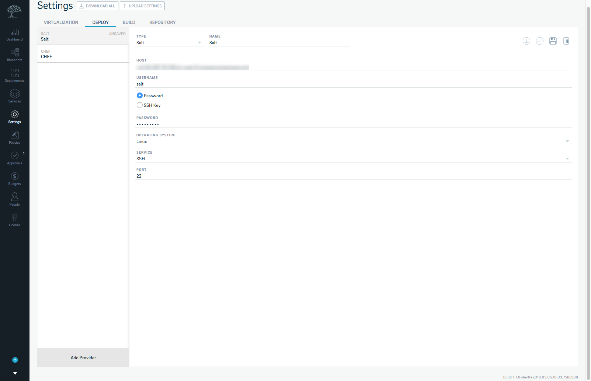

You can delete an existing configuration by selecting it from the list of configurations and clicking on **Delete**. 

You can repeat these instructions to add another Salt configuration if you’d like to. To configure Calm with another deployment tool, pick the provider from the options below for provider specific instructions.

[Chef](#configuring-calm-with-chef)

[Puppet](#configuring-calm-with-puppet)

To configure Calm with Jenkins, click [here](#configuring-calm-with-jenkins).

To configure Calm with your private Docker Registry, click [here](#configuring-calm-with-your-docker-registry)

## Configuring Calm with Jenkins

Calm also comes with an integration with Jenkins to automate your build process. Jenkins is a popular automation server that provides hundreds of plugins that support building, testing, deploying and automation for a variety of projects. In order to help Calm to work with Jenkins, you’ll have to configure Calm accordingly. On integrating with Calm, you can start a Jenkins job, pass arguments to it, collect artifacts from your Jenkins jobs and use them in your blueprints. For example, if you're using Calm to build a Java deployment, you can run a Jenkins job, collect the artifact from it and deploy the artifact on your deployment using Calm. 

To configure Calm to work with Jenkins, do the following:

* Select **Settings** > **Build** > **Add Provider**.

2. Enter appropriate details into the following fields:

    * **Name**

    * **Jenkins Server**

    * **User**

    * **Password**

3. Select **Save**.

4. Select **Verify** to check whether your access credentials work or not. 

You have now successfully configured Calm to work with Jenkins. Your new configuration will be listed by the name you’ve given it under the **Build** tab. 

You can delete an existing configuration by selecting it from the list of configurations and clicking on **Delete**. 

## Configuring Calm with Your Docker Registry

### Before Your Begin

Before you begin configuring Calm with your Docker Registry you’ll need the following:

* A private Docker Registry.
* Valid credentials for your Docker Registry. 

### Instructions

To configure Calm with your Docker Registry, do the following:

* Select **Settings** from the Calm menu. 

2. Select the **Repositories** tab and then **Add** **Provider**. 

3. Select **Docker Registry** from the **Type** drop-down menu. 

4. Give your configuration a **Name**. 

5. Enter a **Resource Sync Interval**. 

6. Enter the **URL** for your Docker Registry. 

7. Enter the **Username** and **Password**. 

8. Select **Save** and then **Verify**. 

Once the configuration has been saved and verified, you will be able to use Calm to spin up instances and deploy deployments using the images in your Docker Registry. 

You can repeat the instructions above to configure another Docker Registry with Calm. 

# Calm Blueprints

A **Blueprint** is the bare framework of every deployment that you model using Calm. It represents a template of your deployment that describes all the steps taken to provision, configure and run tasks on it. You can create a blueprint to represent the architecture of your deployment and then run it repeatedly to instantiate, provision and launch your deployments. It also defines the lifecycle of a deployment and its underlying infrastructure; right from the creation of the deployment and the actions carried out on it, until the termination of the deployment. 

You can use **Blueprints** to model deployments of various complexities; right from simply provisioning a single virtual machine or provision, deploy and manage a multi-node, multi-tier deployment. 

You can access **Blueprints** by clicking on Blueprints from the menu. Doing so brings you to the following screen:

The **Blueprints** page gives you an overview of all the blueprints that you create or have created using Calm. Details such as **Name**, **Created** **By**, **Created On**, **Status** and **Deployments** are listed for blueprints that already exist. 

You can also carry out the following operations on existing blueprints:

* **Run** a blueprint by clicking 

* **Edit** a blueprint by clicking 

* **Clone** or **replicate** a blueprint by clicking 

* **Download** a blueprint by clicking 

* **Delete** a blueprint by clicking 

You can also use this page to create a new blueprint or upload an existing one and run it using Calm. 

Clicking on a blueprint gives you a blueprint detail view, as shown in the figure:

You can use this view to have an **Overview** of the blueprint, its **Topology**, the **Flows** that are part of the blueprint and the **Policies** and **Credentials** configured with it. You can **Edit** or **Run** the blueprint directly from this view. You can also **Share** the blueprint with other teams and users by clicking 

# Creating a Blueprint

To access the **Blueprint Editor**, click **Create Blueprint** on on the Blueprints page. The blueprint editor looks like this:

The blueprint editor consists of a blueprint canvas where you’ll be building your deployment blueprint, tabs for **Topology** and **Credentials** and a panel on the right with tabs for **Overview** and **Policies** that you can use to define the providers that are to be used in the blueprint and the policies and permissions that you’d like to impose on it. On adding services to the blueprint editor, the right panel changes and includes fields for Overview, Variables and Policies that let you provision and configure your services appropriately, define variables and set policies that govern the functioning of the services. 

The blueprint editor also includes buttons that let you **Undo** and **Redo** operations that you’ve done on your blueprint while building it, **Save** your blueprint and **Run** it once the blueprint has been fully modelled. 

# Example Blueprint

Creating a blueprint consists of several steps, depending on the type of deployment that you are modelling. In this example, we will use Calm to model a deployment with AWS EC2 instances that uses a scalable NGINX array with an HAProxy load balancer.

#### Steps to be taken for provisioning the services

* Provision an NGINX array service

* Provision an HAProxy service

* Install Chef on the NGINX array

* Deploy NGINX using a Chef cookbook on the NGINX array.

* Setup NGINX Docroot on the array

* Restart NGINX

* Install Chef on the HAProxy service

* Evaluate the HAProxy configuration

* Deploy HAProxy on the instance using Chef cookbooks. 

#### Steps to be taken to setup flows

* Setup a flow to show all running processes on the NGINX array and the HAProxy service. 

* Setup a scale up flow on the NGINX array

* Setup the evaluation of the HAProxy configuration post scale up. 

* Setup a flow to update the Chef node post scale up. 

* Setup a scale down flow on the NGINX array

* Setup the evaluation of the HAProxy configuration post scale down. 

* Setup a flow to update the Chef node post scale down. 

* Setup a flow on the HAProxy service to print the contents of the HAProxy configuration file. 

## Provisioning Your Services

The first step in building your blueprint is to provision the services that your deployment needs. In this example, we need two services; one is an NGINX array and the other is your HAProxy server. 

Let us add the NGINX array to the canvas. 

* Name your blueprint in the **Blueprint Name** field. 
* In the **Overview** section, add a Description for the blueprint. 
* Select the **Providers** that you'd like to use for this blueprint by their names that you've given in the **Settings** section while configuring Calm. 
* If you'd like to set permissions for this blueprint, pick the teams that you'd like to give access to this blueprint to from the **Permissions** section.

* Select the **Credentials** tab to add a credential for the service. 

!!! tip "Note"
	The new credential that you set should be the default SSH credentials that are used to connect to Ubuntu EC2 images along with your AWS Private Key or the AWS Public Key. 

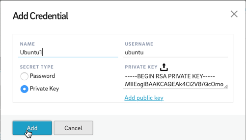

* Select  on the blueprint canvas to add your first service.
* **Name** this service and set the **Provider** **Type** to **Provision AWS EC2**. 
* Under **Array** **Configuration**, select **This is an array service** and set the **Initial Count** to **2**.
* Under **Provider Configuration**, set the **Instance Name**, **Availability Region** and select **Ubuntu 14.04** as the **AMI**. 
* Under **Instance Configuration**, select the **Instance Type**, the **Network** that you’d like to launch into, the **Security** **Groups**, **Shutdown** **Behavior**, **IAM** **Role** and the **Key** **Pair** to connect with your instance.

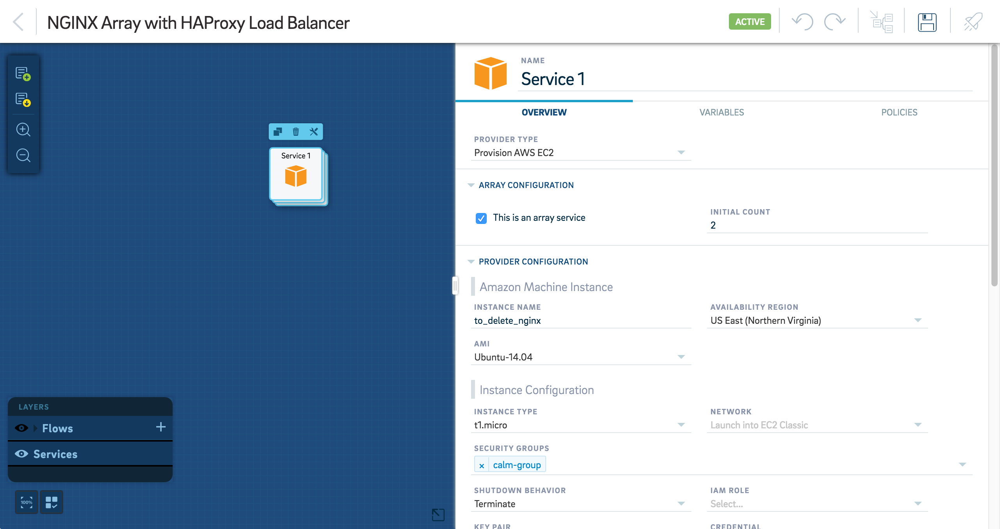

* Optionally, add additional **Storage** and **Tags**. 

8. Ensure that **Service** **Type** is set to SSH under **Attributes**. You can also add the cost of provisioning the EC2 instance in the Cost/HR field if you have configured budgets for your team. The amount that you enter here will be deducted from the budget that you've assigned to the team that is using this blueprint. To know more about budgets, read [Budgets](#budgets).

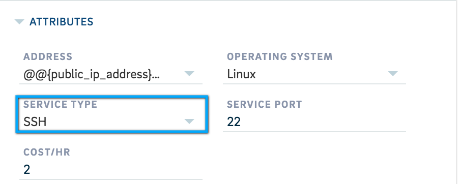

* Select the **Variables** tab to set two **Properties**, the public IP and the public DNS. 

10. Name the first property as **Public IP** and set the **Value** to **Provision AWS EC2 | private_ip_address**.

11. Name the second property as **Public DNS** and set the **Value** to **Provision AWS EC2 | private_dns_name**. This step would ensure that these properties will be available for the haproxy instance to use when required.

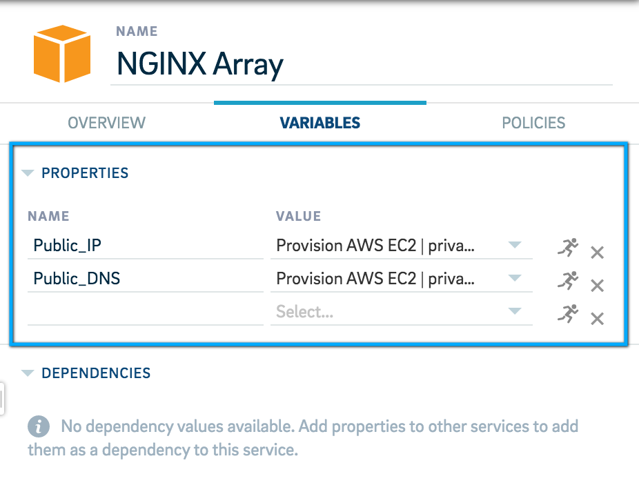

* Optionally, add an **Approval** policy by selecting the Policies tab. 

13. Select **Save**. 

Now that your NGINX array has been added, we can now add the HAProxy server to the canvas in similar fashion. The steps to be followed are similar to those that we followed while adding the NGINX array except that we do not add an **Array** **Configuration**. We also do not need to add a new set of credentials to be used with this service since we are provisioning another Ubuntu EC2 image to act as the HAProxy server and they can be SSH’ed into using the same credentials that we added in the previous step. We will also expose a single variable which is the **Public DNS** of the server and set the value to **Provision AWS EC2 | private_dns_name**. **Save** your blueprint so that the changes that we’ve made take effect. 

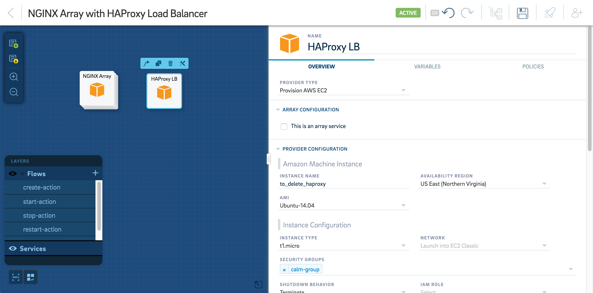

## Creating Dependencies

Since the HAPRoxy server is dependant on the NGINX array for their properties such as the array IP addresses and the DNS, we will define and create dependencies between these two services so that the properties that the HAProxy server is dependant on can be retrieved and used while performing tasks on the deployment or for setting it up. 

To create a dependency between the HAProxy server and the NGINX array, do the following:

* Select the HAPRoxy Server from the blueprint canvas and then select the **Variables** tab. 

2. Under **Dependencies**, add **nginx_addresses** as the name of the first dependency with the value **(NGINX Array Name) | Public IP**. 

3. Add **nginx_dns** as the second dependency with the value **(NGINX Array Name) | Public DNS**. 

!!! tip "Note"
	Here **(NGINX Array Name)** indicates the name that you’ve given to the NGINX array service while adding it to the blueprint.

This creates a dependency between the HAProxy server and the NGINX array to retrieve properties from the NGINX array. 

Alternatively, you can also add dependencies by doing the following:

* Select the HAProxy server from the canvas and click on .

* Extend the arrow to connect it with the NGINX array. This gives you a popup screen where you can add and configure the new dependency.

* Give your dependency a **Name** and select a corresponding and appropriate **Value** from the drop-down menu and then select **OK**. 

 

You can add dependencies only for variables that have been configured in your services while provisioning them.

* Repeat steps **1** to **3** to add your required number of dependencies. 
* Select **Save** to save your blueprint.  

## Adding Tasks To Your Services 

Now that you’re NGINX array and HAProxy services have been added to the blueprint, we need to add tasks that will install the set of software that the services need to function as an NGINX array and an HAProxy server. 

The NGINX array requires Chef to be installed, the use Chef cookbooks to install NGINX on the array, setup a root directory on the array and a restart of the array once the installation and setup is complete. In order to add tasks to carry out these operations, do the following:

### Installing Chef on the Array

* Select the NGINX array service from the blueprint canvas and then click , **Create** and then **Add Task**.

2. Give the task a **Name** and select **Run** **Shell** as the task **Type**. 

3. Select **Ubuntu** as the **Credential** to be used on the service. 

4. Enter a **Script** that installs Chef.

* Select **Save**. 

### Using Chef To Deploy NGINX on the Array 

* Select **Add Task** on the NGINX array. 

2. **Name** the task.  

3. Select **Deploy** **Chef** as the task **Type**.

4. Under **Task Configuration**, enter the **Node Name** as shown below. 

5. Select the NGINX **Cookbook** and its **Version**. 

6. Select a **Role** and the **Environment**. 

7. Set the **Credential** to **Ubuntu**. 

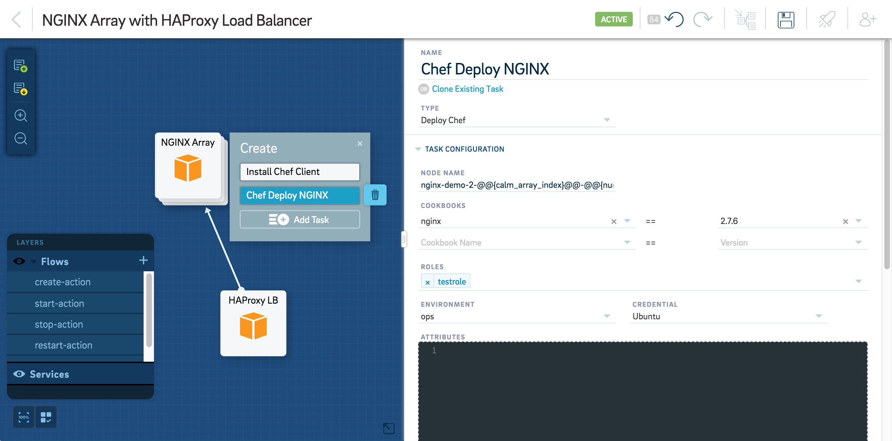

* Select **Save**.

### Setting Up Nginx Docroot

* Select **Add Task** on the NGINX array.  

2. **Name** the task. 

3. Select **Run** **Shell** as the task **Type**. 

4. Select **Ubuntu** as the **Credential** to be used on the service. 

5. Enter a **Script** that sets up a root directory on the array. 

* Select **Save**. 

### Restart Nginx

* Select **Add Task**. 

2. **Name** the task. 

3. Select **Run** **Shell** as the task **Type**. 

4. Use **Ubuntu** as the **Credential**. 

5. Enter a **Script** that restarts the array service. 

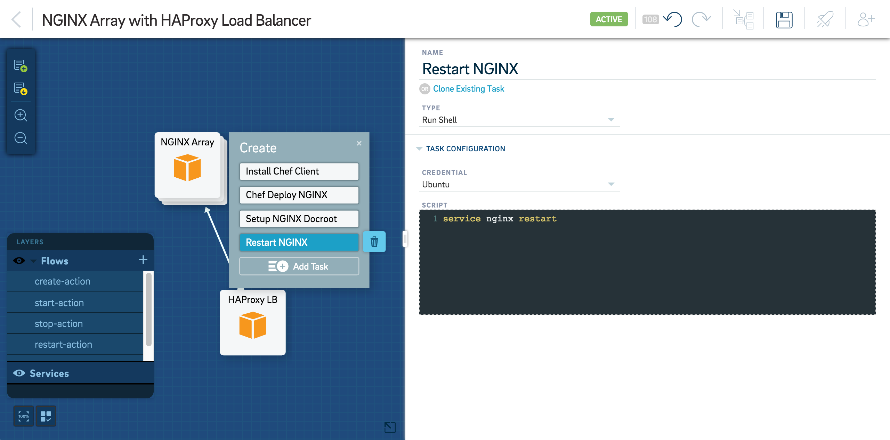

* Select **Save**. 

The HAProxy server requires a Chef installation, the use Chef cookbooks to install HAproxy on the service and an evaluation of the HAProxy configuration on the service. In order to add tasks to carry out these operations, do the following:

### Install Chef Client

* Select the HAProxy service from the blueprint canvas. 

2. Select **Add Task**. 

3. **Name** the task. 

4. Select **Clone Existing Task** and select the task that installs the Chef client from the list of tasks that are already configured. 

* Select **Save**. 

### Eval HAProxy Configuration

* Select **Add Task**. 

2. Select **Eval** as the task **Type**. 

3. Select **Ubuntu** as the **Credential**. 

4. Enter a script to evaluate the HAProxy configuration in the **Script** box. 

* Set the **Out Arguments** as `config_block`.

6. Select **Save**. 

### Using Chef To Deploy HAProxy on the Service

* Select **Add Task** and then **Name** it. 

2. Select **Deploy Chef** as the task **Type**.

3. Under **Task Configuration**, enter the **Node Name**.

4. Select the HAProxy **Cookbook** and its **Version**. 

5. Select a **Role** and the **Environment**. 

6. Set the **Credential** to **Ubuntu**. 
7. Set `@@{config_block}@@` as an **Attribute**. 

* Select **Save**.

Now both of your services are configured to install the required tools while they’re being provisioned. Once the provisioning is complete, you will have a fully functioning deployment consisting of an NGINX array and an HAProxy server. 

## Creating Flows

Once your services have been provisioned and configured to function appropriately, you will need to setup the tasks that you’d like to run on the deployment once it is deployed.

In this example, we will add the following flows:

* **Show Processes** to list the processes that are running on your deployment at any given time. 

* **Scale Up** to scale the array up by two nodes when needed. 

* **Scale Down** to scale the array down by two nodes when needed. 

* **Show HAProxy Configuration** to show the contents of the HAProxy configuration file. 

To create these flows on your blueprint, do the following:

### Adding the Show Processes Flow

* Select **+** to add a flow. 

* **Name** the flow. 

3. Choose whether the flow is **Critical**. 
!!! tip "Note"
	If a critical flow is running, any subsequent flow runs will be queued until this flow has finished executing.

* Select the NGINX array. 

5. Select **Add** **Task** and **Name** it. 

6. Select **Run** **Shell** as the task **Type** and then select **Ubuntu** as the **Credential**. 

7. Enter the **Script** to show running processes.

8. Select the HAProxy service. 

9. Select **Add** **Task** and **Name** it. 

* Select **Clone Existing Task** and select the task that shows running processes that you configured 

* Select **Save**. 

### Adding the Scale Up Flow

* Select **+** to add a flow. 

2. **Name** the flow. 

3. Choose whether the flow is **Critical**. 

!!! tip "Note"
	If a critical flow is running, any subsequent flow runs will be queued until this flow has finished executing.

* Select the NGINX array and then 

5. Select **Add Scale Up**.

6. Name the task and select by how many nodes you’d like to **Scale Up By**. 

7. Select the HAProxy service and select **Add Task**. 

We will now have to add two tasks in this flow on the HAProxy service to evaluate the HAProxy configuration and then update the Chef node accordingly. 

* Name the task and select **Clone Existing Task**. 

9. Select the task that evaluates the HAProxy configuration from the list of tasks that you’ve already configured.

10. Select **Add Task**, **Name** it and select **Update Chef Node** as the task type. 

11. Enter the **Task Configuration** as shown in the figure below: 

* Select  on the NGINX array and connect it with the task on the HAProxy service that evaluates the HAProxy configuration. This step ensures that the HAProxy conducts the HAProxy evaluation and updates the Chef node immediately after the NGINX array scales up. 

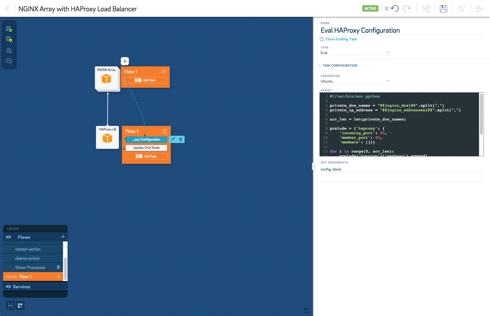

* Select **Save**. 

### Adding the Scale Down Flow

* Select **+** to add a flow. 

2. **Name** the flow. 

3. Choose whether the flow is **Critical**.
!!! tip "Note"
	If a critical flow is running, any subsequent flow runs will be queued until this flow has finished executing. 

* Select the NGINX array and then 

5. Select **Add Scale Down**.

6. Name the task and select by how many nodes you’d like to **Scale Down By**. 

7. Select the HAProxy service and select **Add Task**. We will now have to add two tasks in this flow on the HAProxy service to evaluate the HAProxy configuration and then update the Chef node accordingly. 

8. Name the task and select **Clone Existing Task**. 

9. Select the task that evaluates the HAProxy configuration from the list of tasks that you’ve already configure. 

10. Select **Add Task**, **Name** it and then select **Clone Existing Task** to clone the task that updates the Chef node.

11. Select  on the NGINX array and connect it with the task on the HAProxy service that evaluates the HAProxy configuration. 
This step ensures that the HAProxy conducts the HAProxy evaluation and updates the Chef node immediately after the NGINX array scales down. 


12. Select **Save**. 

### Adding the Flow That Shows the HAProxy Configuration File

* Select **+**  to add a flow. 

2. **Name** the flow. 

3. Choose whether the flow is **Critical**. 
!!! tip "Note"
	If a critical flow is running, any subsequent flow runs will be queued until this flow has finished executing.

* Select the HAProxy service. 

5. Select **Add Task**, **Name** it and select **Run Task** as the task **Type**. 

6. Select **Ubuntu** as the **Credential** and enter the script that shows the contents of the HAProxy configuration file. 

7. Select **Save**. 

Now that we’ve added all the tasks that need to be run on your deployment, your blueprint is complete and ready to be executed. 

## Running Your Blueprint

Now that your blueprint is built, you can execute it to spin up your deployment. Before you proceed, make sure you’ve saved all of your changes by clicking Save. 

To spin up a deployment from your blueprint, do the following:

* Select  to run your blueprint. 

2. Enter a **Deployment Name** for your deployment. 

3. Select  to confirm whether Calm is able to communicate with the various providers that will come into play once your blueprint is executed.

4. Select  

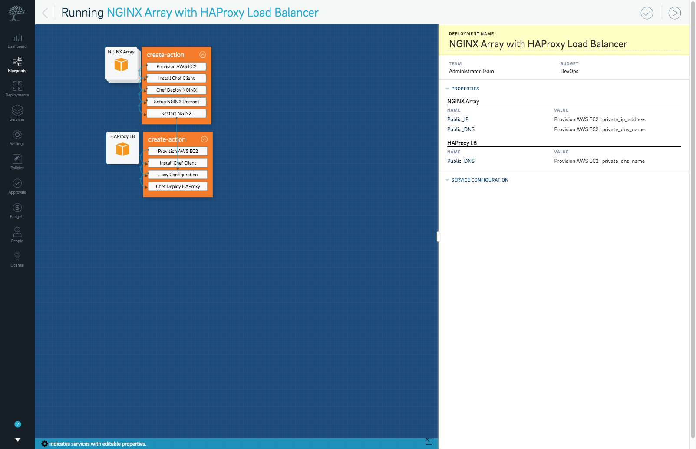

This initiates the execution of your blueprint and takes you to the **Deployments** dashboard that gives you a real-time view of your blueprint being executed. 

# Deployments

**Deployments** are created as a result of building and running blueprints using Calm. You can access the list of deployments by clicking **Deployments** from the dashboard menu. 

The **Deployments** page shows a list of all the deployments that you’ve spun up using Calm. The deployments are tabulated and listed along with the following parameters:

* **Name**

* **Blueprint**

* **Status**

* **Created By**

* **Created On**

* **Expires On**

You can also filter and search deployments by **Name**, **Blueprint Name**, **Status**, **Created After Date** and **Created Before Date** by clicking on the **filter** icon. 

Deployments can be deleted directly from this view by clicking  next to the deployment that you’d like to delete. 

## Deployments Dashboard

The **Deployments** dashboard lets you have a closer look at all of the deployments that you’ve built using Calm. Selecting a deployment from the **Deployments** view takes you to an individual deployment dashboard that gives you deeper insights such as:

* **Overview**

* **Services**

* **Topology**

* **Flows**

* **Policies**

* **Credentials**

This dashboard comes with a search bar at the top-right corner that lets you search for services, flows, policies and credentials that you’ve configured while building the blueprint for your deployment. 

You can also add flows to modify an deployment, directly from the **Deployment** dashboard.

### Overview

The **Overview** section of the dashboard is the default view that you get after selecting an deployment from the **Deployment** view. It gives you an overview of the status of the resources that constitute the deployment. 

It also gives you information about who created the deployment and the time elapsed since its creation, the number of services that have spawned as a result of the deployment along with a status-wise distribution for each service and the variables associated with the deployment. 

You can also view the **Activity** of the deployment over any time range and a detailed Timeline that lets you drill down into the finest aspects of each flow, their statuses, outputs and the time taken to complete each flow. 

### Services

The **Services** tab gives you a snapshot of all the services and instances that have been created after running a blueprint. Each service is depicted by a tile that contains the following information:

* **Name**

* **Type**

* **Status** (represented visually)

* **Error notification**, if any (represented visually)

Selecting an individual **Service** tile brings up a panel on the right that lets you deep dive into the various aspects of that particular service such as the Variables that are generated while your services are brought up and a History of actions taken during its provisioning. Selecting each item listed under History gives you details such as when each task was carried out, how long it took and the output for each task. 

You can also **Start**, **Stop** or **Restart** a service from this panel.

### Topology

The **Topology** tab displays the bare architecture of the deployment along with the status of the tasks and flows that you’ve configured to be run during the execution of the blueprint. The view can be filtered to display each flow, the flow runs, their associated tasks and their result. 

To view the details of a flow run on your topology, select a flow from the Flows drop-down menu. Selecting a flow run from the **Flow** **Run** drop-down menu shows the status of the flow run and the set of tasks that were executed during the run. Selecting each task further expands their view to display the following details:

* The name of the task.

* The date and time that it was initiated.

* The time taken to complete the task.

* Service

* Run by

* Last Updated

* Output

You can also download the logs for each task or flow run by clicking 

### Flows

The **Flows** tab lets you view and run the collection of flows that you’ve configured on the blueprint of the deployment. Each flow is represented by a tile containing the name of the flow. The first flow is selected and its details are displayed in a panel on the right. This panel contains an option to view the flow in the **Topology** and an option to run the flow. 

!!! tip "Note"
    Only custom flows will have the option of running the flow from within the deployment. Create-action and delete-action flows will only have a single run, the details of which can be viewed in this panel. 

The panel also enlists the following details:

* **Deployment Variables**, which enlists all the variables generated by and associated with the flow and your deployment. 

* **Services**, enlists the services that the flow acts upon and the service variables.  

* **Flow Steps** enlists the configuration of the flow as defined in the blueprint. It also shows the task configuration of the flow. 

* **History** enlists a history of the past runs of the flow. You can select a flow run from the **History** to view the flow status, flow details and the output of the flow during that particular flow run. 

### Policies

The **Policies** tab enlists the policies that govern the creation of your deployment. These policies are configured while building your blueprint and are represented in the form of a collection of tiles, depending on the number of policies you’ve configured. 

Each policy is represented by a single tile. Each policy tile contains the following information:

* Policy type

* When and where each policy is triggered

* Users and teams that the policy is dependant on

### Credentials

Credentials enlists all the credentials that have been configured in the blueprint of the deployment. These credentials are represented in the form of a collection of tiles, depending on the number of credentials you’ve configured.

Each credential is represented by a single tile. Each credential tile contains the following information:

* **Name of the credential**

* **Username**

* **Type of credential**

## Managing Deployments

All the deployments that you spin up using Calm can be managed from its respective deployment dashboard. This gives you a command over running flows whenever you need to, start, stop or restart each individual service, disable policies and retire deployments once they’re no longer needed. 

### Running Flows/Commands

To run a flow on your deployment, do the following:

* Select the **Flows** tab. 

2. Select the **Flow** that you’d like to run. This opens up a panel on the right with an option to run the flow and view deployment variables, services the flow is associated with, flow steps and flow history. 

3. Select  to run a flow. 

* Ensure the properties that have been selected for the flow are correct. 

* Select **Run**. 

The flow will now begin running and a new entry will be populated under **History**. To abort the flow, select **Abort Flow**. To view the flow in your deployment topology, select .

You can also create a new flow to be run on an active deployment. To do so, do the following:

* Select **Edit**. 

2. Select **+** 

3. Select **Add Task** on the service on which you’d like to run the flow. 

4. **Name** it. 

5. Select the **Type** of task from the drop-down menu. 

6. Enter appropriate details and values into the fields that appear under **Task** **Configuration** once you have selected your task type. 

7. Select **Save**. 

8. Select **Back** and then **Flows**. The new flow that you’ve added will appear in the collection of flows. 

9. Select the new flow that you’ve added and then . 

You will now have created and run a new flow on a running deployment, the output of which can be viewed under **History**. 

### Start/Stop/Restart Services

Calm lets you start, stop and restart individual services within a deployment at any moment. This feature is useful when you build a deployment that contains services that aren't required to run continually. This also helps you stay away from incurring expenses towards keeping an instance running when it isn't required. 

To start, stop or restart your services, do the following:

* Select the **Services** tab. 

2. Select the **Service** that you would like to manage. 

3. Select **Start**, **Stop** or **Restart**.

### Enabling and Disabling Policies

You can use the **Deployments** dashboard to enable or disable policies on services and flows on active deployments on the fly. To enable or disable a service level policy, do the following:

* Select **Edit**. 

2. Select the service on which you’d like to enable or disable a policy. 

3. Select the **Policies** tab. 

4. Use the toggle button next to the policy that you’d like to enable or disable. Make sure you configure the policy you’re enabling appropriately. 

5. Select **Save** and then **Back** to return to the **Deployments** dashboard. 

In case you’ve enabled a policy, you can view it by selecting the service on which it was enabled from the **Services** tab and looking for it under the **Policies** section. Disabled policies will no longer figure in the **Policies** view on the **Deployments** dashboard. 

To enable or disable a flow level policy, do the following:

* Select **Edit**. 

2. Select the flow on which you’d like to enable or disable a policy. 

3. Select the **Policies** tab. 

4. Use the toggle button next to the policy that you’d like to enable or disable. Make sure you configure the policy you’re enabling appropriately. 

5. Select **Save** and then **Back** to return to the **Deployments** dashboard. 

In case you’ve enabled a policy, you can view it by selecting the flow on which it was enabled from the **Flows** tab and looking for it under the **Policies** section. 

# Services

The **Services** view displays all the services that have been instantiated and managed by using Calm. Services that are not managed by Calm but are available on your virtualization platforms are also inlcuded in this view so that you don't have to log into your virtualization accounts to view and manage your services. 

You can also Stop and Restart services from this view, and have a look at the **Deployments** that your services are a part of. 

## Viewing Services

You can access **Services** by clicking on **Services** from the menu. 

The **Services** view lists all the services that are managed and not managed by Calm. The services are listed in a grid or a list view along with details such as  the following:

* VM Name
* Service Name 
* Deployment
* State
* Provider Type
* Settings Name
* Managed
* VM IP
* Last Modified
* Creation Time
 
The view of your services are paginated, depending on the number of services you have, and can be navigated using page numbers or by clicking **<** or **>**.
You can also search and filter services by clicking on the search bar and selecting an appropriate filter. You can search for and filter the services being listed based on their **State**, **Provider Type**, **Calm Managed**, **Machine Name**, **Deployment**, **VM IP**, **VM Name** and **Settings Name**. 

## Managing Services

The **Services** page also lets you Stop and Restart your services directly from Calm, thereby eliminating the need to log into your virtualization account to do these operations. 

To manage a service, do the following:

* Select the service from those that are listed in the **Services** view. This opens a panel on the right that contains details related to the service. 

* To stop a service, click .
* To restart a service, click .

#Global Policies

Calm lets you configure a set of global Policies that lets you exercise more control over events related to scaling, deployment, flow runs, resiliency, service rollbacks and upgrades and VM actions that occur during the usage of Calm. You can set policies that enforce approval requests, notifies the administrator  or sets expiries for blueprints and deployments in Calm. 

You can access Policies by selecting Policies from the menu. You can use the Policies view to create new global Policies and edit existing ones. The types of Policies that you can create and configure are as follows:

* Approval 
* Expiry
* Notification

For more information on the Approval, Expiry and Notification policies, read [Policies and Permissions](#policies-and-permissions).

You can also pick from the following events to trigger these policies into action:

* **Auto Scale Down**
* **Auto Scale Up**
* **Create Deployment**
* **Delete Deployment**
* **Flow Run**
* **Resiliency**
* **Restart Deployment**
* **Service Rollback**
* **Service Upgrade**
* **Start Deployment**
* **Stop Deployment**
* **VM Restart**
* **VM Stop**
* **VM Restart**

The global policies that you configure need to fulfill certain **Criteria** that you can configure according to your need. For example, you can configure a **Notification** policy to send out a notification whenever a user runs a blueprint with a specific name or if the blueprint name contains certain keywords that are part of the criteria that you set. **Criteria** can be configured using **Objects**, **Operators** and **Values**. The **Objects** that you can configure for a criteria are as follows:

* **Object**
* **Blueprint Name**
* **Budget Name**
* **Deployment Name**
* **Provider Type**
* **Settings Name**
* **Task Name**
* **Task Type**
* **Team Name**
* **User Name**

The **Operators** that you can use to configure your criteria are as follows:

* **like**: Used to search for all objects that match the specified pattern (Perl style regular expression) as the value for the attribute. The **like** operator is case-sensitive. 
* **notlike**: Used to search for all objects that don't match the specified pattern (Perl style regular expression) as the value for the attribute. The **notlike** operator is case-sensitive. 
* **ilike**: Used to search for all objects that match the specified pattern (Perl style regular expression) as the value for the attribute. The **ilike** operator is not case-sensitive. 
* **==**: Used to search for all objects that match the exact specified value for the attribute. The **==** operator is case-sensitive.
* **!=**: Used to search for all objects that don't match the exact specified value for the attribute. The **!=** operator is case-sensitive.

## Adding a Global Policy

To add a new global Policy, do the following:

* Select **Create Policy** on the **Policies** page.

* Give it a **Name**.
* Choose whether you'd like to enable it by default by using the toggle button under **Enabled**.
* Select the **Event** for which you'd like to set a global policy. 
* Select the **Policy Type** for the policy that you're setting. 
* Select the **Teams**, **Users** and **Email addresses** to send a request or notification.
* Set the **Criteria** to trigger the policy by choosing an appropriate **Object**, **Operator** and **Value**. 
* Select **Add Criteria**, to add another criteria. Else, select **Save Policy** to save the policy. You can also reset the form and re-configure your policy by selecting **Reset**.

Your new global polocy will now be set. 

## Editing a Global Policy

To edit a global policy, do the following:

* Select the policy that you'd like to edit. 
* Use the toggle button to enable or disable the policy. 
* Add or remove **Teams**, **Users** or **Email** addresses using the appropriate dropdown menus. 
* Edit or add new criteria from the **Criteria** subsection. You can remove criteria by clicking  next to the **Criteria** that you'd like to delete. 
* Click **Update** to update the policy. Click **Reset** if you'd like to reset the changed values of the policy to the default ones. 

# Approvals

The **Approvals** tab gives you an overview of all the approvals that are either pending for you or all the pending approvals if you're the admin, approved or rejected for each blueprint or action that have approvals configured along with them. 

You can access **Approvals** by clicking on **Approvals** on the menu. 

The approvals are sorted into three tabs, namely, **Pending**, **Approved** and **Rejected**. By default, clicking on **Approvals** brings you to the Pending tab on the **Approvals** page. 

## Viewing and Approving Pending Approval Requests

This tab tabulates all the blueprints that are pending approval. The table that lists these blueprints have the following parameters:

* **Approval For** lists the name of the blueprint for which the approval is pending. 

* **Flow** lists the name of the flow that triggered the approval request.

* **Deployment** lists the name of the deployment whose creation depends on the approval of its blueprint. 

* **From** lists the name of the user who has requested for the approval. 

* **Waiting On** lists the name or email ID of the user who needs to approve or reject the blueprint. 

* **Date** lists the date on which the approval request was triggered. 

* **Actions** lists the actions that can be taken by the approver on the request. 

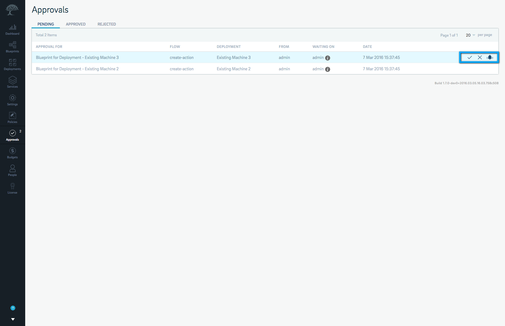

This view gets paginated as the number of blueprints being listed increases. Each page can list up to 20 blueprints. The pages can be navigated by clicking either the **<** or **>** at the bottom of the table. You can also select a page number from the drop down menu to go directly to a specific page number. 

Based on your user role, you can use this tab to either **Approve** or **Reject** a blueprint or action or **Remind** the approver that their approval is pending.

Notifications for blueprints and actions awaiting your approval show up on your Calm menu, like this:

## Viewing Approved Reqeusts

You can view a list of approved blueprints and actions and actions by clicking on the **Approved** tab. This tab lists all the blueprints that have been approved by their respective approvers. The approved blueprints and actions are listed in a table with the following parameters:

* **Approval For** contains the name of the blueprint that has been approved. 

* **Flow** lists the name of the flow that triggered the approval. 

* **Deployment** is the name of the deployment that was to be deployed by running the blueprint. 

* **From** lists the team or the user who requested an approval.

* **Waiting On** lists the details of the approver. 

* **Date** lists the date on which the blueprint was approved.

* **Approved By** lists the details of the approver who approved the blueprint. 

This view gets paginated as the number of blueprints being listed increases. Each page can list up to 20 blueprints. The pages can be navigated by clicking either the **<** or **>** at the bottom of the table. You can also select a page number from the drop down menu to go directly to a specific page number. 

## Viewing Rejected Actions

You can view a list of rejected blueprints and actions by clicking on the **Rejected** tab. This tab lists all the blueprints and actions that have been rejected by their respective approvers. The rejected blueprints and actions are listed in a table with the following parameters:

* **Approval For** contains the name of the blueprint that has been approved. 

* **Flow** lists the name of the flow that triggered the approval. 

* **Deployment** is the name of the deployment that was spun off by running the blueprint. 

* **From** lists the team or the user who requested an approval.

* **Waiting On** lists the details of the approver. 

* **Date** lists the date on which the blueprint was rejected.

* **Rejected By** lists the details of the approver who rejected the blueprint. 

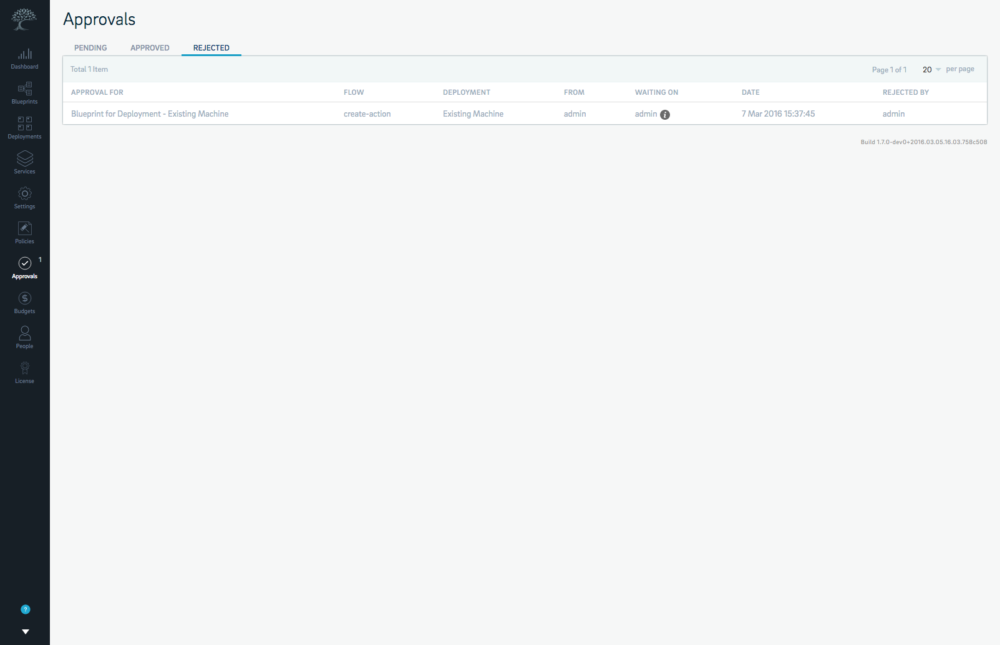

# Budgets

Calm includes a **Budget** feature that lets you manage resource allocations to your teams. The allocation of resources are carried out in the form of budgets that you can create and assign to your teams. Each service and blueprint that your teams utilize and execute will have costs that are charged to the budgets that you create and allocate. 

You can access **Budgets** by clicking on **Budgets** from the menu. The **Budgets** page is as shown in the figure below:

The **Budgets** page shows all the budgets that you’ve created and assigned to the teams that use Calm. It also shows the extent to which each budget has been consumed, the number of deployments done under each budget and the owner of each budget. You can search for budgets by their name by clicking **Filter** icon and entering the name of the budget in the search field. 

## Creating a Budget

* Select **Create Budget**.

2. Enter appropriate details into the following fields:

    * **Name**

    * **Amount**

    * **Threshold**

3. Select a **Team** from the dropdown menu to which you’d like to assign the budget to. 

* Select **Create**. You can reset the form and start over by selecting **Reset**. 

## Managing Budgets

There may be times when you’d want to revisit the budgets you’ve created and assigned and modify them. All the budgets that you have created can be modified right from the **Budgets** view. To modify a budget, do the following:

* Select the budget that you’d like to modify. This opens a panel on the right with budget parameters that can be edited by you. 

2. Modify the **Name**, **Budget**, **Threshold** and **Team**, as required. 

* Select **Save** once you’ve made changes. You can also reset the budget to its original values by clicking **Reset**. 

# People

The **People** feature on Calm lets you add, view and manage users and teams that will use Calm. You can also use this feature to change permissions for existing users and set a new password for them, if the need be. 

You can access **People** by clicking on the **People** icon from the menu. This will take you to the **People** view where all **Users** and **Teams** that you create in Calm are listed.

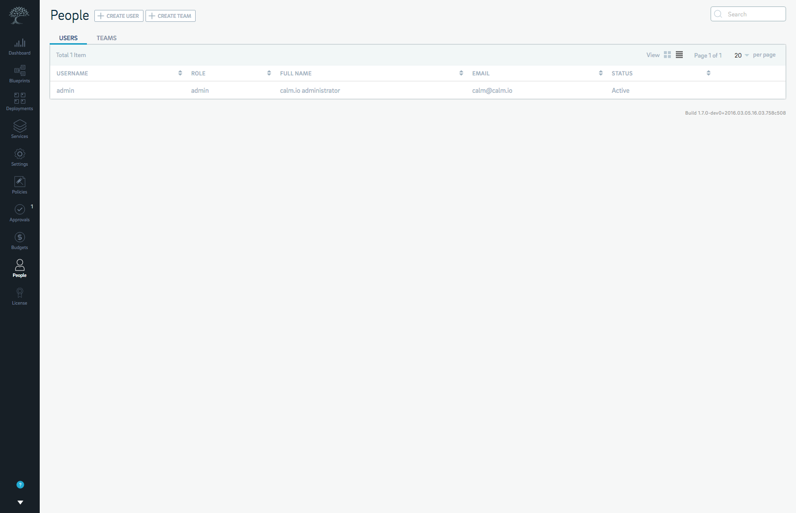

## Users

A **user** is someone who has access to using Calm with valid credentials and a set of permissions associated with their user account. 

### User Roles

Calm has three types of users:

* **Admin**: An **Admin** account is created by default with every installation of Calm. An **Admin** is typically a systems administrator in charge of managing Calm and assigning tasks and responsibilities to various admins, users and teams. An **Admin** has complete admin, execute, read and write permissions over the entire Calm installation. 

* **Author**: An **Author** account is one that is created by the **Admin** of the Calm account. An **Author** has read, write and execute permission over blueprints and deployments in Calm. An Author can delete only those blueprints and deployments that they have created. 

* **Consumer**: A **consumer** account normally has read and execute access that is limited to the team that the user is a part of and the inventory, blueprints and deployments that the user has been assigned to use. A **consumer** can run blueprints and manage deployments and their associated services but can neither create or manage blueprints and deployments or configure Calm differently. They can, however, save deployments as a blueprint on Calm. 


* Operator: An **Operator** account only has read permissions over blueprints and read and execute permissions over deployments that are part of the inventory assigned to the team that he/she belongs to. 

By default, every installation of Calm comes with a **Admin** user account with a set of default credentials. You can use this account to create more users and teams within Calm. You can change your **Admin** account password after you sign in to Calm. For more information, view [Changing Your Account Password](#changing-your-account-password).

### Creating a User

To add a user, do the following:

* Select **Create** **User** on the People view.

2. Enter a **Username**, the **Full Name** and the **Email** ID of the user you’re creating. 

3. Select a **Role** and **Team** from the respective drop-down lists. 

!!! tip "Note"
	If no teams have been added to Calm before adding a user, every user you create will be assigned to a default global group. You can reassign users to teams after your teams have been created. 
	
* Select the checkbox under **Set** **Default** **Password?**, if you’d like to set a password for the user.

5. Enter a new password and confirm the password you entered. 

* Select **Create**. 

### Managing a User

You can also use the People feature to manage users, reassign them to other teams, modify user details and roles and reset their passwords. 

To manage a User that you’ve created, do the following:

* Select the **Users** tab from the **People** page. 

2. Select the user that you’d like to modify. This opens a panel on the right that contains the details of the user that you can edit. 

3. Change any of the following parameters based on your need:

    * **Username**

    * **Full Name**

    * **Email**

    * **Role** (select the new role from the dropdown menu)

    * **Status** (in case you’d like to remove a user or reactivate a deactivated user)

    * **Password** (in case you’d like to create a new password for the user)

4. Select **Update** for the changes to take effect and be saved. Select **Reset** to reset the form to the original values. 

## Teams

A **team** is a collection of users that use Calm. **Teams** can be categorized and populated by adding users who conduct the same operations using Calm and share the same permissions and privileges. Having **teams** is also a great way to delegate tasks routinely and to implement role-based access control schemes. 

### Creating Teams

You can create a **team** directly from the **People** page. 

To add a team, do the following:

* Select **Create Team**. 

2. **Name** it. 

3. Optionally, add a **Description**. 

Your new team will now appear under the **Teams** tab. 

### Managing Teams

Once your team is created, you can either edit the team or view and manage members in each team. 

To manage your teams, do the following:

* Select the team that you’d like to edit from the **Teams** tab. This opens a panel on the right with properties that you can edit. This panel also lists all the users in the team you’ve selected. 

2. Edit the **Name** and **Description**, based on your requirement. 

3. Select **Manage** **Members** to manage the members in your team. 

4. Select/Deselect the users that you’d like to add or remove. 

5. Select **Save**. 

The changes that you’ve made to your team will now take effect. 

# Account Settings

You can view all the information about your Calm account and also change your account password from the **My Account** section on the Calm menu. 

## Viewing Your Account Information

To access your account information, click on  and then **My Account** from the bottom left corner of the Calm menu. You will see a popup screen with two tabs named **Overview** and **Change Password**. 

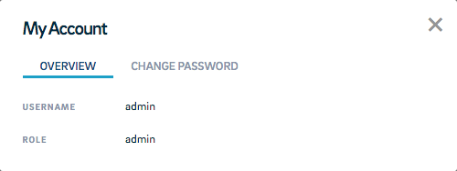

The **Overview** tab on this popup displays your Calm username and the user role. 

## Changing Your Account Password

To change your account password:

* Select the **Change Password** tab. 

2. Enter your old password, then enter a new password and confirm the new password. 

3. Select **Save**. Select **Reset**, to reset the form and start over. 

!!! tip "Note"
    Your password should be at least 8 characters long and must include at least:

	* one lowercase and one uppercase letter
	* one number
	* one symbol

# Signing Out

You can sign out of your Calm account by clicking on  and then **Sign Out**.

